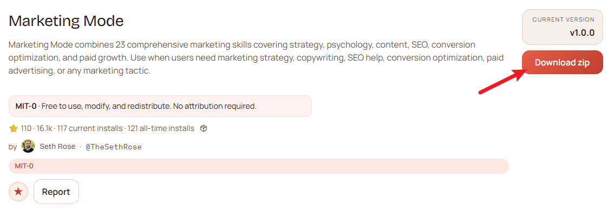
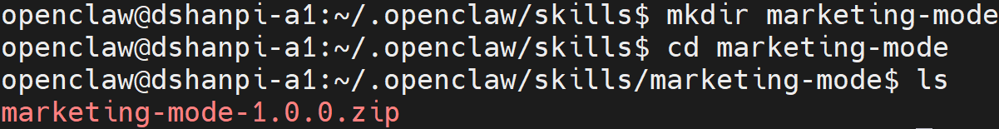
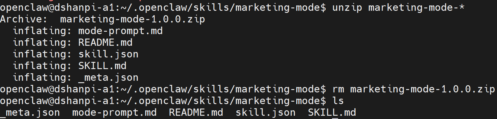
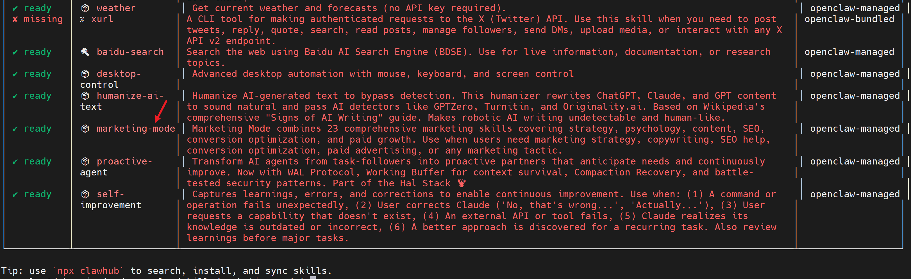
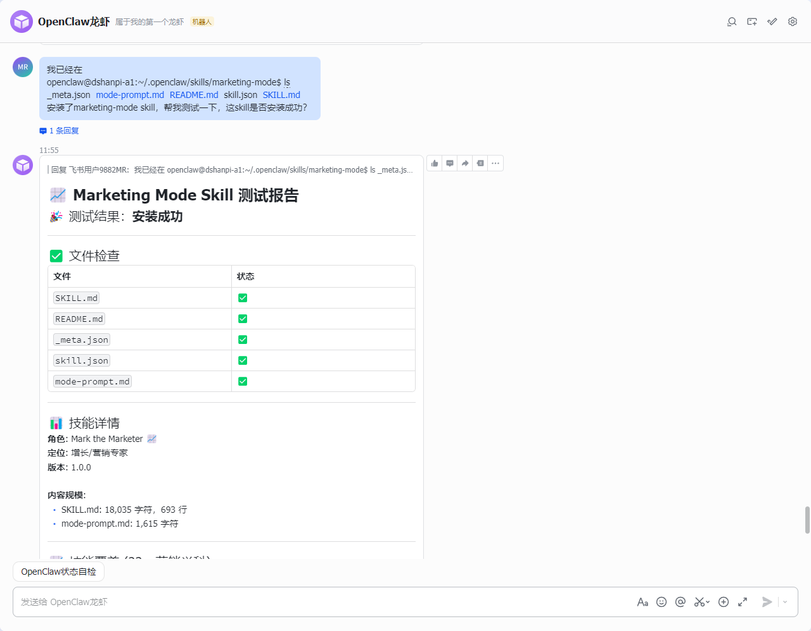

# OpenClaw增加营销技能

营销模式结合了23项涵盖策略、心理学、内容、SEO、转化优化和付费增长的综合营销技能。当用户需要营销策略、文案写作、SEO帮助、转化优化、付费广告或任何营销策略时，都可以使用。


## 1.安装

1.前往([marketing-mode — ClawHub](https://clawhub.ai/TheSethRose/marketing-mode))点击下载获取压缩包，或者直接点击[Marketing Mode](https://wry-manatee-359.convex.site/api/v1/download?slug=marketing-mode)。




2.新建`marketing-mode`文件夹，并将下载好的`marketing-mode-1.0.0.zip`（后续版本可能不一样），拷贝至`marketing-mode`目录下。

```
#新建文件夹
mkdir marketing-mode

#进入文件夹
cd marketing-mode

#拷贝压缩包至该目录下
```




3.解压压缩包

```
#解压压缩包
unzip marketing-mode-*

#解压完成后，删除压缩包
rm marketing-mode-1.0.0.zip
```




4.扫描Skills

```
openclaw skills
```




5.重启openclaw gateway

```
openclaw gateway restart
```


## 2.测试

直接想Web UI的对话页面或者飞书对话界面，直接提问： 

```
我已经在
openclaw@dshanpi-a1:~/.openclaw/skills/marketing-mode$ ls
_meta.json  mode-prompt.md  README.md  skill.json  SKILL.md
安装了marketing-mode skill，帮我测试一下，这skill是否安装成功？
```

