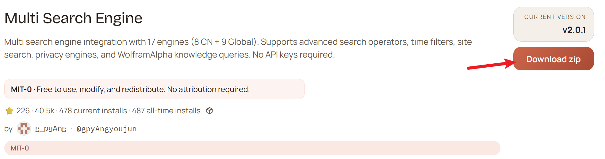
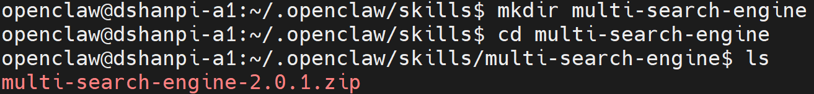
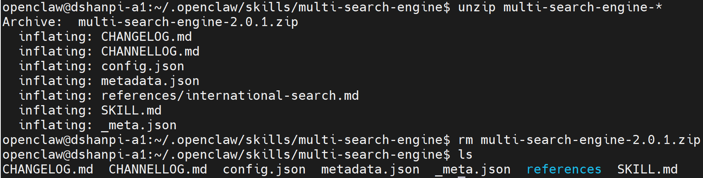
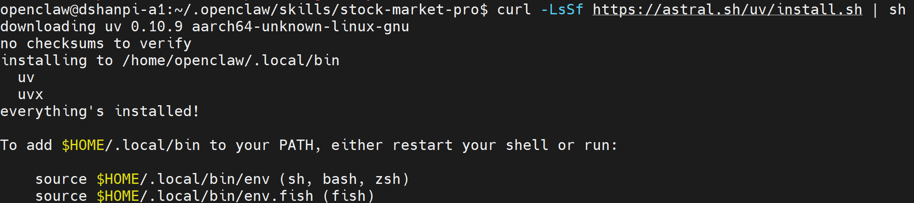
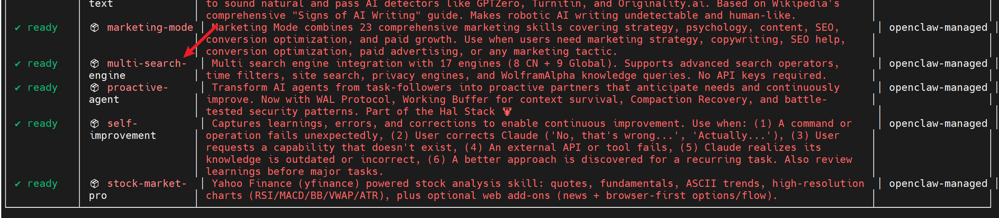
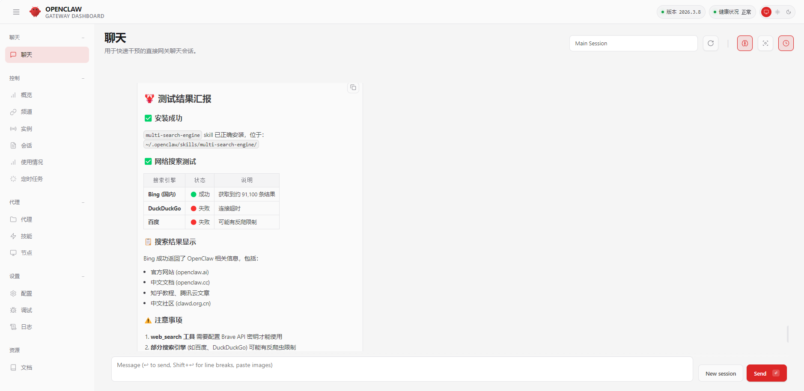

# OpenClaw支持多引擎网络搜索

多搜索引擎集成，包含17个搜索引擎（8个CN + 9个全球搜索引擎）。支持高级搜索作符、时间筛选、网站搜索、隐私引擎以及 WolframAlpha 知识查询。不需要API密钥。


## 1.安装

1.前往[多搜索引擎 — ClawHub](https://clawhub.ai/gpyAngyoujun/multi-search-engine)点击下载获取压缩包，或者直接点击[Multi Search Engine](https://wry-manatee-359.convex.site/api/v1/download?slug=multi-search-engine)。



2.新建`multi-search-engine`文件夹，并将下载好的`multi-search-engine-2.0.1.zip`（后续版本可能不一样），拷贝至`multi-search-engine`目录下。

```
#进入skill目录
cd .openclaw/skills/

#新建文件夹
mkdir multi-search-engine

#进入文件夹
cd multi-search-engine

#拷贝压缩包至该目录下
```



3.解压压缩包

```
#解压压缩包
unzip multi-search-engine-*

#解压完成后，删除压缩包
rm multi-search-engine-2.0.1.zip
```



4.安装uv工具

```
curl -LsSf https://astral.sh/uv/install.sh | sh
```



4.扫描Skills

```
openclaw skills
```




5.重启openclaw gateway

```
openclaw gateway restart
```


## 2.测试

直接向Web UI的对话页面或者飞书对话界面，直接提问： 

```
我已经在
openclaw@dshanpi-a1:~/.openclaw/skills/multi-search-engine$ ls
CHANGELOG.md  CHANNELLOG.md  config.json  metadata.json  _meta.json  references  SKILL.md
安装了multi-search-engine skill，帮我测试一下，这skill是否安装成功？你能不能正常进行网络搜索？
```

