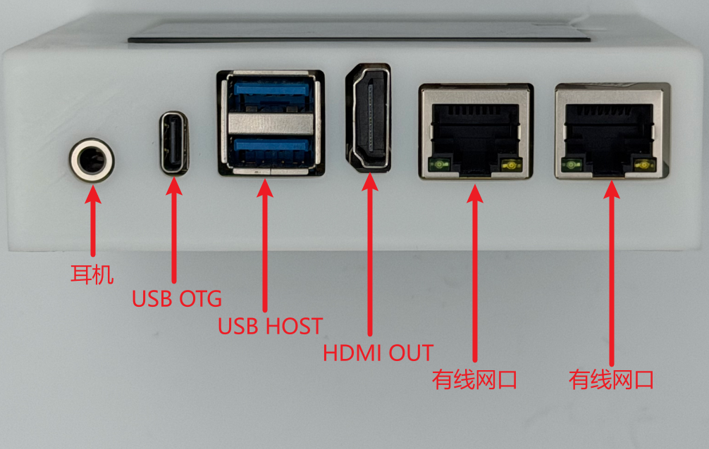
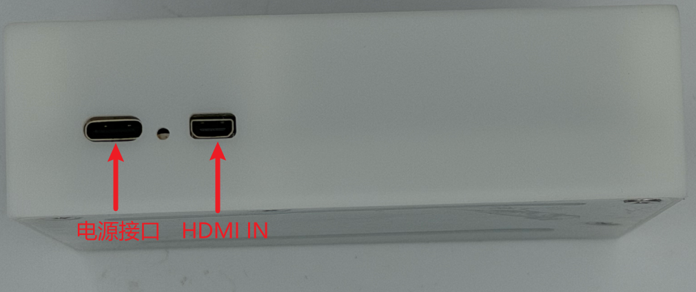

# 硬件规格与接口

## 硬件规格

OpenCla主机使用瑞芯微RK3576 芯片，ARM 64位高性能八核通用处理器，计算及扩展能力通用性强。硬件主要参数如下：

| 组件     | 规格                                                         |
| -------- | ------------------------------------------------------------ |
| **SoC**  | 瑞芯微 RK3576（8nm工艺）                                     |
| **CPU**  | 八核64位：4×Cortex-A72 @ 2.2GHz + 4×Cortex-A53 @ 1.8GHz      |
| **GPU**  | Mali-G52 MC3，支持 OpenGL ES 1.1/2.0/3.2、OpenCL 2.0、Vulkan 1.1/1.2 |
| **NPU**  | 6 TOPS 算力                                                  |
| **内存** | 8GB LPDDR4                                                   |
| **存储** | 64GB eMMC存储                                                |

## 硬件接口

本章节展示OpenClaw小主机的外设接口。

- 耳机：可接入3.5mm耳机，用于声音输出。
- USB OTG：USB 3.0 OTG 接口可用于多种功能，例如：**DP Alt Mode**可连接 Type-C 显示器或通过转接线连接 DP 显示器。或者用于系统更新等。
- USB HOST：用于连接USB设备，可连接USB鼠标、USB键盘、USB读卡器等。
- 有线网口：连接有线网络，用于实现有线网络上网。

- 电源接口：用于给整个OpenClaw主机进行供电，
- HDMI IN：用于输入HDMI信号，用法直接接入HDMI信号后，使用video节点。

