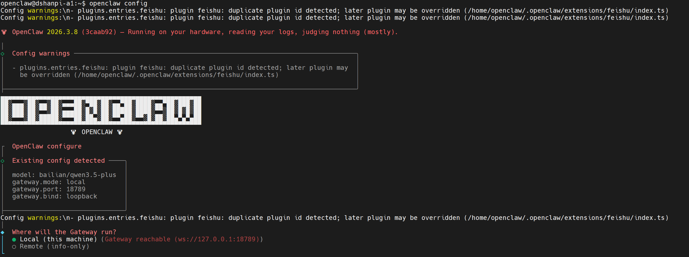
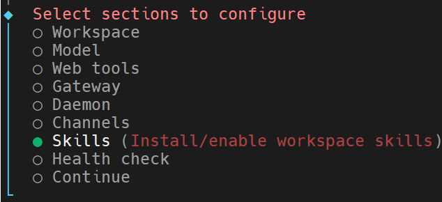
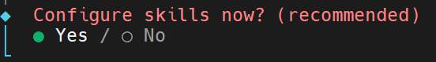
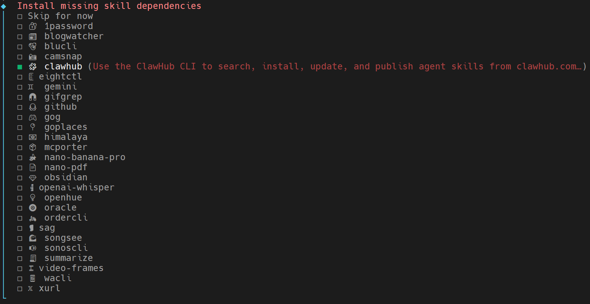
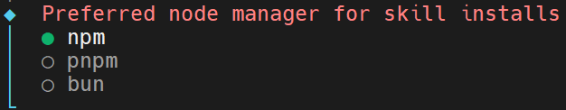
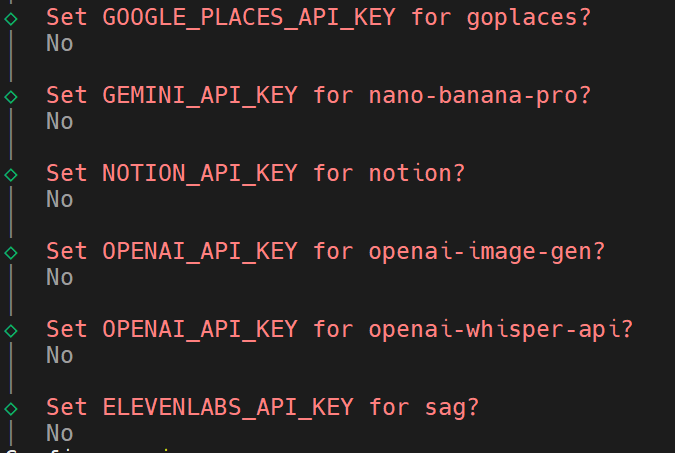
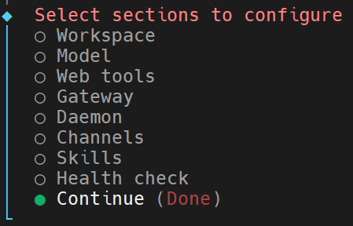
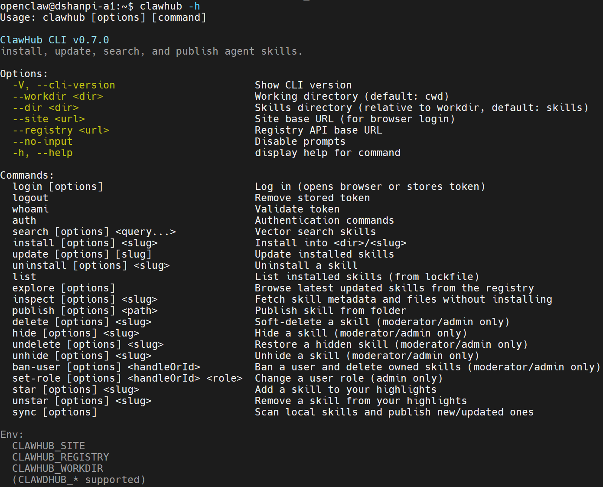

# 安装Clawhub

## 1.简介

ClawHub 是 OpenClaw 的 **Skill 市场（Registry）**，类似 npm 之于 Node.js 或 Docker Hub 之于 Docker。

```
┌─────────────┐         ┌─────────────┐         ┌─────────────┐
│   ClawHub   │ ──────► │  clawdhub   │ ──────► │   OpenClaw  │
│  (Registry) │  下载   │   (CLI)     │  安装   │  (运行时)   │
│ clawhub.com │         │  npm 包     │         │ ~/.openclaw │
└─────────────┘         └─────────────┘         └─────────────┘
```


## 2.安装

目标新版本的OpenClaw可以使用配置功能下载clawhub，在命令输入：

```
openclaw config
```



选择**Local (this machine)**



选择**Skills**



选择**Yes**



使用空格键选中**clawhub**后，按下回车键。



选择**npm**方式进行安装。



后续要求提供的API Key都选择**No**。



最后选择**Continue**。

## 3.测试

在终端输入：

```
clawhub -h
```




## 4.增加工具权限

修改**openclaw.json**配置文件：

```
vi .openclaw/openclaw.json
```

找到工具配置项，将原来的：

```
 "tools": {
    "profile": "messaging"
  },
```

修改为：

```
 "tools": {
    "profile": "full"
  },
```

修改完成后，按下`Esc`+`:wq`


最后重启openclaw服务

```
openclaw gateway
```

