# OpenClaw接入平台API Key

本教程将详细指导你如何将OpenClaw接入阿里云百炼平台，包括获取API Key、配置模型等完整步骤。

:::tip 选择配置方式
根据你的访问方式，选择下方对应的配置标签页：
- **本地配置**：直接在设备本地浏览器访问，无需配置SSH隧道和网关令牌
- **远程配置**：通过Windows浏览器远程访问，需要配置SSH隧道和网关令牌
:::

---

## 一、阿里云百炼平台

### 1.1 登录阿里云

访问阿里云官网：[阿里云-计算，为了无法计算的价值](https://cn.aliyun.com/)

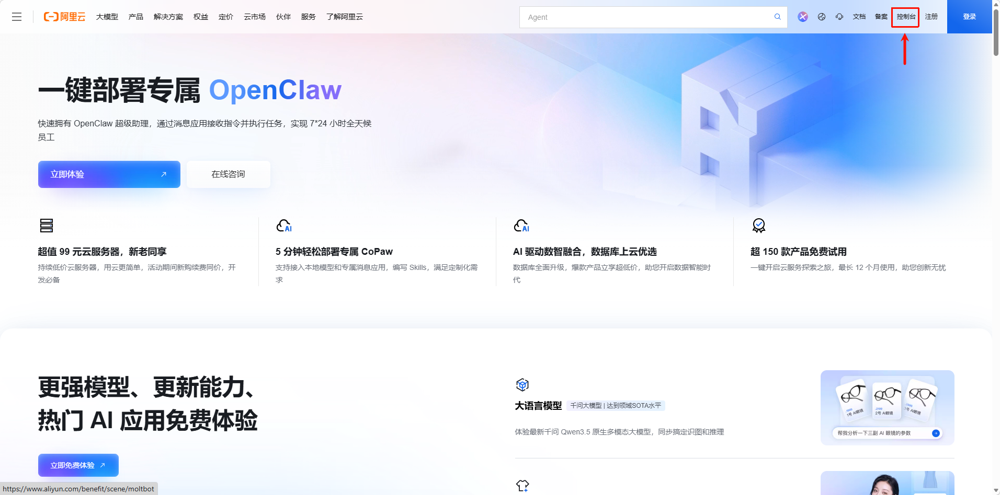

使用以下任一方式登录：
- 阿里云账号
- 支付宝
- 钉钉

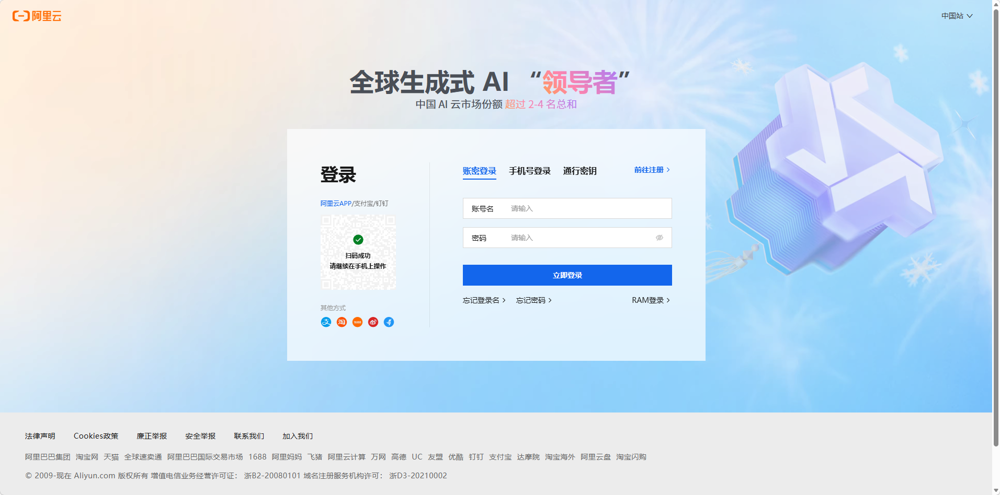

### 1.2 购买Coding Plan

进入阿里百炼控制台，购买Coding Plan：

访问地址：[大模型服务平台百炼控制台](https://bailian.console.aliyun.com/cn-beijing/?tab=coding-plan#/efm/index)

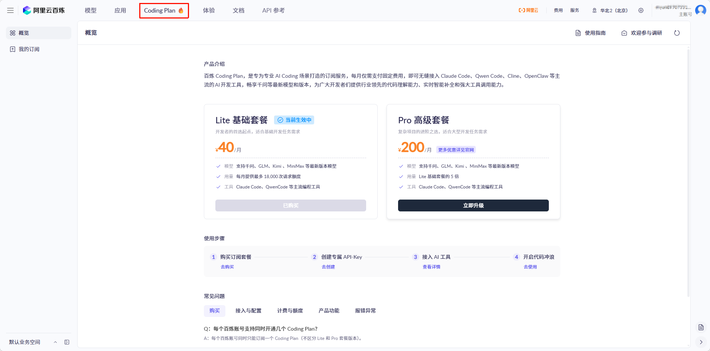

### 1.3 获取API Key

复制并保存你的API Key，后续配置需要使用。

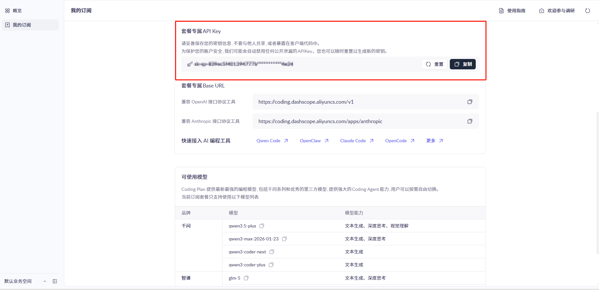

### 1.4 参考文档

参考阿里云百炼平台文档接入OpenClaw：

[大模型服务平台百炼控制台文档](https://bailian.console.aliyun.com/cn-beijing/?tab=doc#/doc/?type=model&url=3023085)

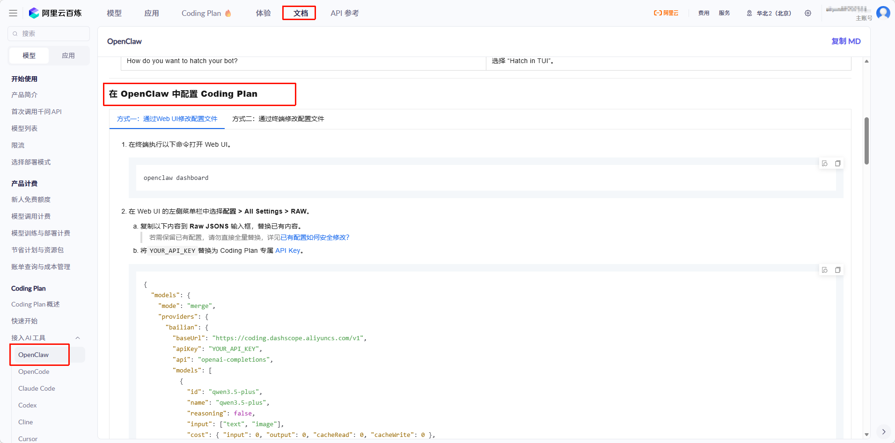

---

## 二、访问OpenClaw界面

import Tabs from '@theme/Tabs';
import TabItem from '@theme/TabItem';

<Tabs groupId="access-method">
  <TabItem value="local" label="本地配置" default>

### 本地浏览器访问

直接在设备本地浏览器中访问OpenClaw界面：

```bash
http://localhost:18789
```

无需配置SSH隧道和网关令牌，直接跳到 [配置openclaw.json](#四配置openclawjson) 章节。

  </TabItem>
  <TabItem value="remote" label="远程配置">

### Windows浏览器远程访问

#### 2.1 配置SSH隧道

假设你的设备信息如下：
- IP地址：`192.168.1.55`
- 默认端口：`18789`
- 用户名：`openclaw`

在Windows PowerShell中执行以下命令：

```bash
ssh -N -L 18789:127.0.0.1:18789 openclaw@192.168.1.55
```

输入密码后，将其放在后台运行。

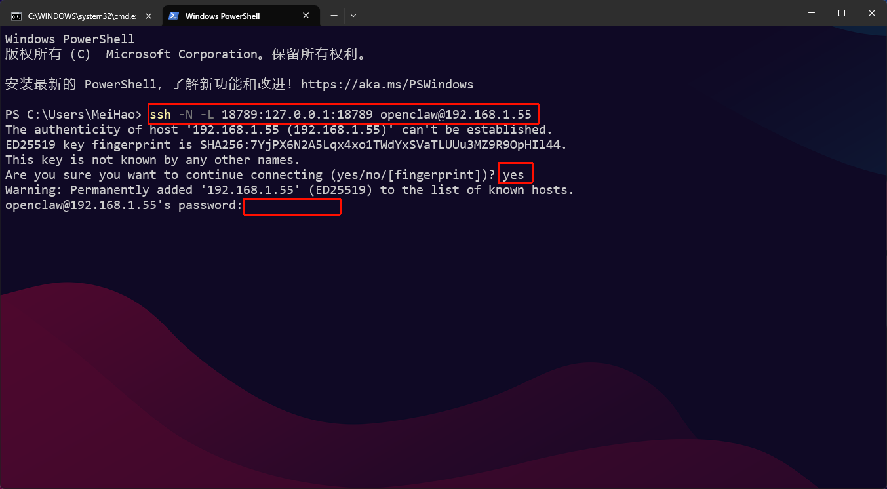

#### 2.2 访问OpenClaw界面

配置完成后，在Windows浏览器中访问：

```bash
http://localhost:18789
```

  </TabItem>
</Tabs>

---

## 三、配置网关令牌

<Tabs groupId="access-method">
  <TabItem value="local" label="本地配置">

:::tip 无需配置
本地浏览器访问无需配置网关令牌，直接跳过此章节，进入 [配置openclaw.json](#四配置openclawjson)。
:::

  </TabItem>
  <TabItem value="remote" label="远程配置">

如果Windows浏览器提示：

```
unauthorized: gateway token missing (open the dashboard URL and paste the token in Control UI settings)
```

你需要配置网关令牌。

### 3.1 查看网关令牌

在终端执行以下命令：

```bash
cat ~/.openclaw/openclaw.json
```

找到`gateway`字段，查看网关令牌。

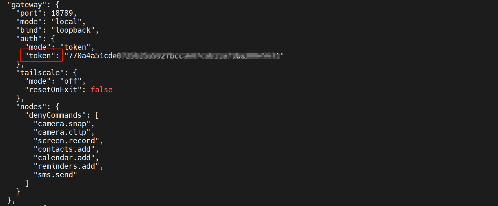

### 3.2 填入网关令牌

将网关令牌填入：

**"概览"** → **"网关令牌"** → **"连接"**

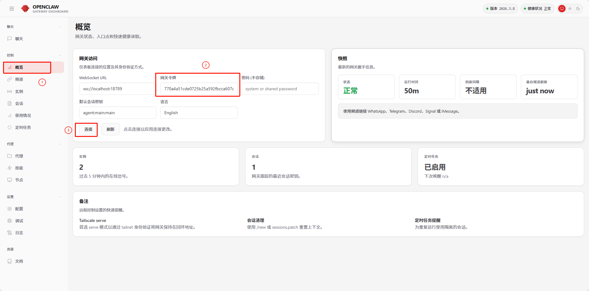

  </TabItem>
</Tabs>

---

## 四、配置openclaw.json

参考阿里云百炼文档，在Web UI的左侧菜单栏中选择 **配置 > All Settings > RAW**。

### 4.1 配置步骤

1. 复制以下内容到 **Raw JSONS** 输入框，替换已有内容
2. 将 `YOUR_API_KEY` 替换为Coding Plan专属[API Key](https://bailian.console.aliyun.com/cn-beijing/?tab=model#/efm/coding_plan)
3. 单击右上角 **Save** 保存，然后单击 **Update** 使配置生效

```json
{
  "models": {
    "mode": "merge",
    "providers": {
      "bailian": {
        "baseUrl": "https://coding.dashscope.aliyuncs.com/v1",
        "apiKey": "YOUR_API_KEY",
        "api": "openai-completions",
        "models": [
          {
            "id": "qwen3.5-plus",
            "name": "qwen3.5-plus",
            "reasoning": false,
            "input": ["text", "image"],
            "cost": { "input": 0, "output": 0, "cacheRead": 0, "cacheWrite": 0 },
            "contextWindow": 1000000,
            "maxTokens": 65536
          },
          {
            "id": "qwen3-max-2026-01-23",
            "name": "qwen3-max-2026-01-23",
            "reasoning": false,
            "input": ["text"],
            "cost": { "input": 0, "output": 0, "cacheRead": 0, "cacheWrite": 0 },
            "contextWindow": 262144,
            "maxTokens": 65536
          },
          {
            "id": "qwen3-coder-next",
            "name": "qwen3-coder-next",
            "reasoning": false,
            "input": ["text"],
            "cost": { "input": 0, "output": 0, "cacheRead": 0, "cacheWrite": 0 },
            "contextWindow": 262144,
            "maxTokens": 65536
          },
          {
            "id": "qwen3-coder-plus",
            "name": "qwen3-coder-plus",
            "reasoning": false,
            "input": ["text"],
            "cost": { "input": 0, "output": 0, "cacheRead": 0, "cacheWrite": 0 },
            "contextWindow": 1000000,
            "maxTokens": 65536
          },
          {
            "id": "MiniMax-M2.5",
            "name": "MiniMax-M2.5",
            "reasoning": false,
            "input": ["text"],
            "cost": { "input": 0, "output": 0, "cacheRead": 0, "cacheWrite": 0 },
            "contextWindow": 196608,
            "maxTokens": 32768
          },
          {
            "id": "glm-5",
            "name": "glm-5",
            "reasoning": false,
            "input": ["text"],
            "cost": { "input": 0, "output": 0, "cacheRead": 0, "cacheWrite": 0 },
            "contextWindow": 202752,
            "maxTokens": 16384
          },
          {
            "id": "glm-4.7",
            "name": "glm-4.7",
            "reasoning": false,
            "input": ["text"],
            "cost": { "input": 0, "output": 0, "cacheRead": 0, "cacheWrite": 0 },
            "contextWindow": 202752,
            "maxTokens": 16384
          },
          {
            "id": "kimi-k2.5",
            "name": "kimi-k2.5",
            "reasoning": false,
            "input": ["text", "image"],
            "cost": { "input": 0, "output": 0, "cacheRead": 0, "cacheWrite": 0 },
            "contextWindow": 262144,
            "maxTokens": 32768
          }
        ]
      }
    }
  },
  "agents": {
    "defaults": {
      "model": {
        "primary": "bailian/qwen3.5-plus"
      },
      "models": {
        "bailian/qwen3.5-plus": {},
        "bailian/qwen3-max-2026-01-23": {},
        "bailian/qwen3-coder-next": {},
        "bailian/qwen3-coder-plus": {},
        "bailian/MiniMax-M2.5": {},
        "bailian/glm-5": {},
        "bailian/glm-4.7": {},
        "bailian/kimi-k2.5": {}
      }
    }
  },
  "gateway": {
    "mode": "local"
  }
}
```

填入位置如下：

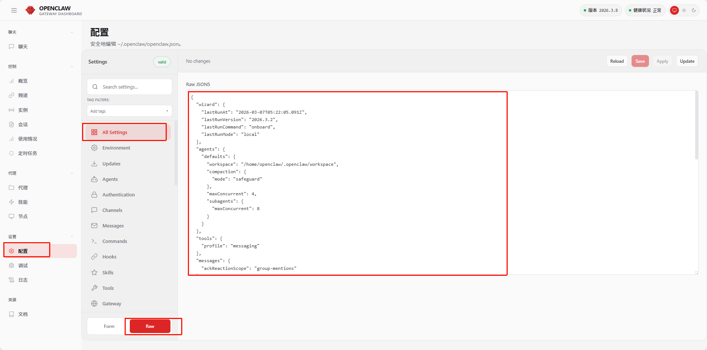

最终配置如下：

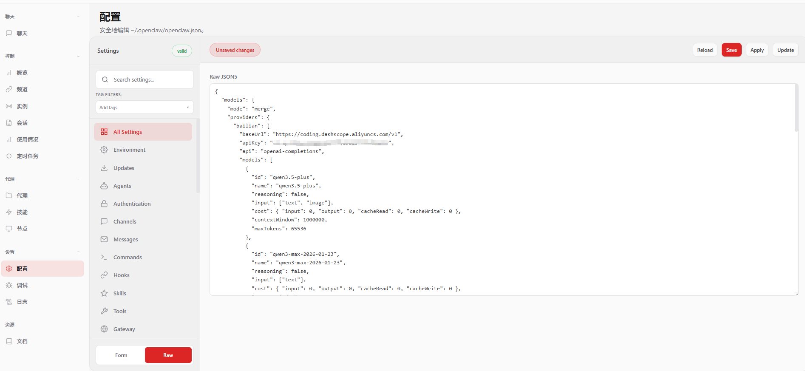

---

## 五、重新配置网关令牌

<Tabs groupId="access-method">
  <TabItem value="local" label="本地配置">

:::tip 无需配置
本地浏览器访问无需重新配置网关令牌，直接刷新页面即可。
:::

  </TabItem>
  <TabItem value="remote" label="远程配置">

Reload之后，网关令牌会重新刷新，Windows浏览器会再次提示：

```
unauthorized: gateway token missing (open the dashboard URL and paste the token in Control UI settings)
```

需要在 **"概览"** → **"网关令牌"** → **"连接"** 重新填入新的网关令牌。

网关令牌同样在 `~/.openclaw/openclaw.json` 中查看。

  </TabItem>
</Tabs>

---

## 六、验证配置

最后，右上角健康情况显示正常，你就可以在聊天框与OpenClaw开始聊天了！

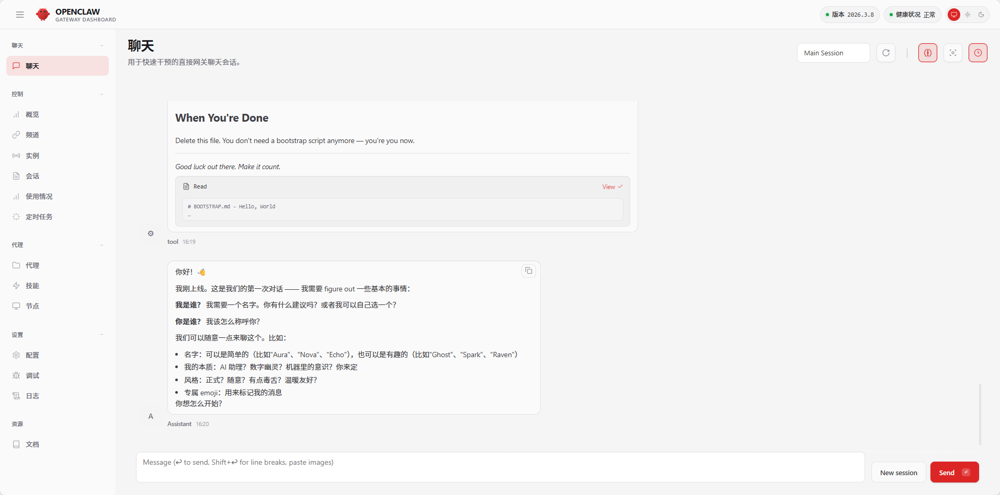

---

## 常见问题

### Q: 如何查看我的设备IP地址？
A: 在设备终端执行 `ifconfig` 或 `ip addr` 命令查看。

### Q: 网关令牌忘记了怎么办？
A: 重新执行 `cat ~/.openclaw/openclaw.json` 查看。

### Q: 配置后无法连接怎么办？
A: 检查API Key是否正确，网络连接是否正常，以及网关令牌是否已更新。
