# 增加桌面控制Skill

高级桌面自动化，包含鼠标、键盘和屏幕控制


## 1.安装

1.前往[clawhub Desktop Control](https://clawhub.ai/matagul/desktop-control)点击下载获取压缩包，或者直接点击[Desktop Control](https://wry-manatee-359.convex.site/api/v1/download?slug=desktop-control)。

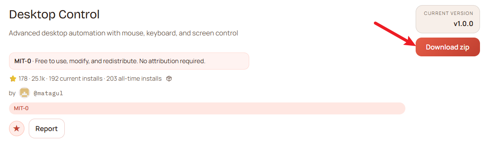


2.新建`desktop-control`文件夹，并将下载好的`desktop-control-1.0.0.zip`（后续版本可能不一样），拷贝至`desktop-control`目录下。

```
#新建文件夹
mkdir desktop-control

#进入文件夹
cd desktop-control

#拷贝压缩包至该目录下
```

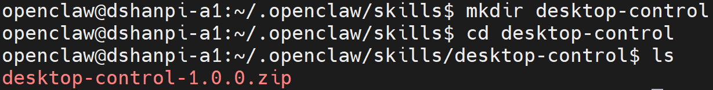

3.解压压缩包

```
#解压压缩包
unzip desktop-control-*

#解压完成后，删除压缩包
rm desktop-control-1.0.0.zip
```

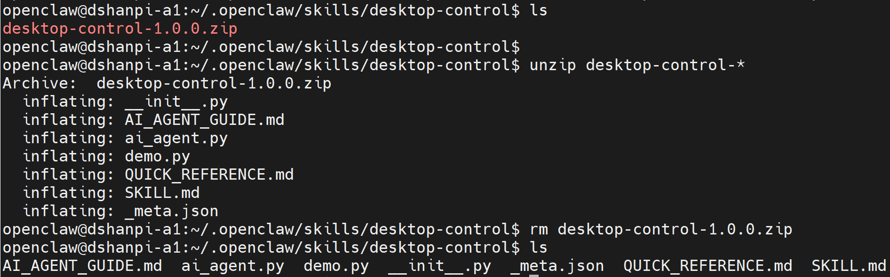

4.安装基础依赖

```
# 1.安装pip工具
sudo apt install -y python3 python3-pip python3.12-venv python3-tk python3-dev -y

# 2.进入 Skill 目录
cd ~/.openclaw/skills/desktop-control

# 3.创建虚拟环境
python3 -m venv venv

# 4. 激活虚拟环境
source venv/bin/activate

# 5.使用pip安装依赖包
pip3 install pyautogui pillow opencv-python pygetwindow
```

后续使用时要先激活环境：

```
source ~/.openclaw/skills/desktop-control/venv/bin/activate
```

退出虚拟环境

```
deactivate
```


5.扫描Skills

```
openclaw skills
```

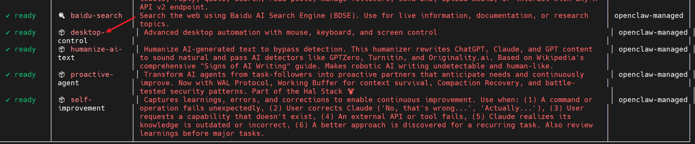

6.重启openclaw gateway

```
openclaw gateway restart
```

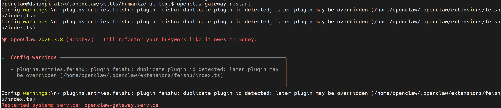


## 2.测试

直接想Web UI的对话页面或者飞书对话界面，直接提问： 

```
我已经在
(venv) openclaw@dshanpi-a1:~/.openclaw/skills/desktop-control$ ls
AI_AGENT_GUIDE.md  ai_agent.py  demo.py  __init__.py  _meta.json  __pycache__  QUICK_REFERENCE.md  SKILL.md  TEST_REPORT.md  venv
安装了desktop-control skill,并且在venv虚拟环境中安装好了对应了依赖包，帮我测试一下，这skill是否安装成功，顺便帮我测试一下
```

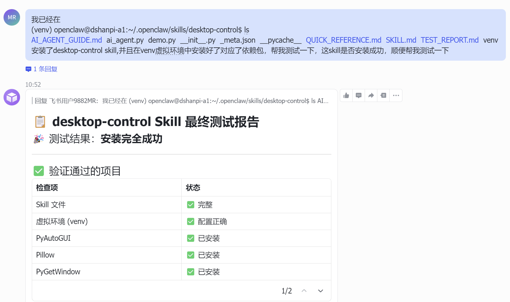

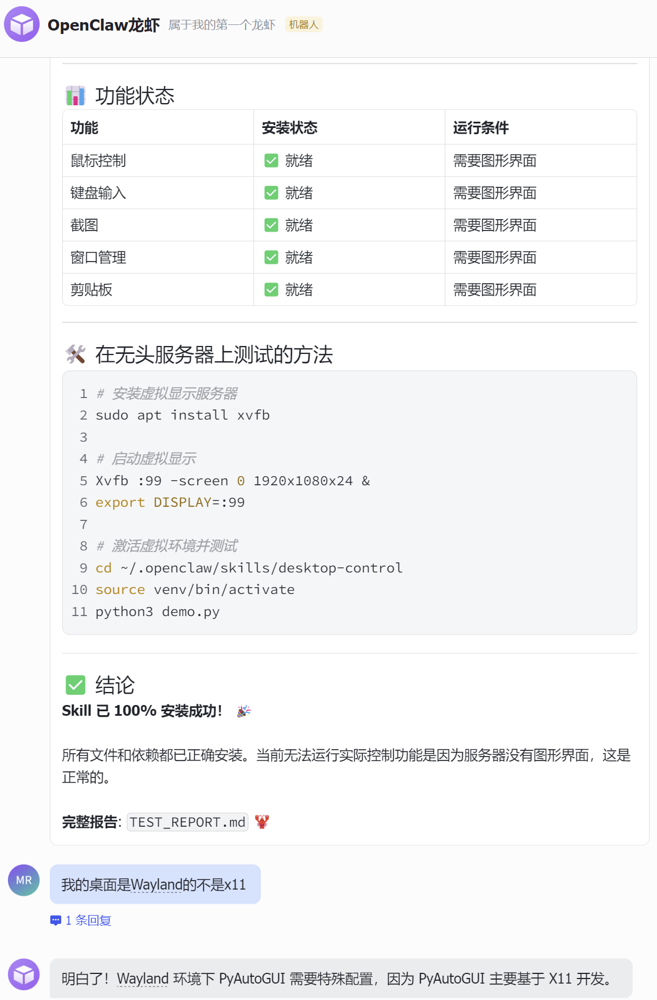

接下来我按照提示执行命令，还是会提示错误，继续将错误发送给龙虾，让他帮我解决问题：

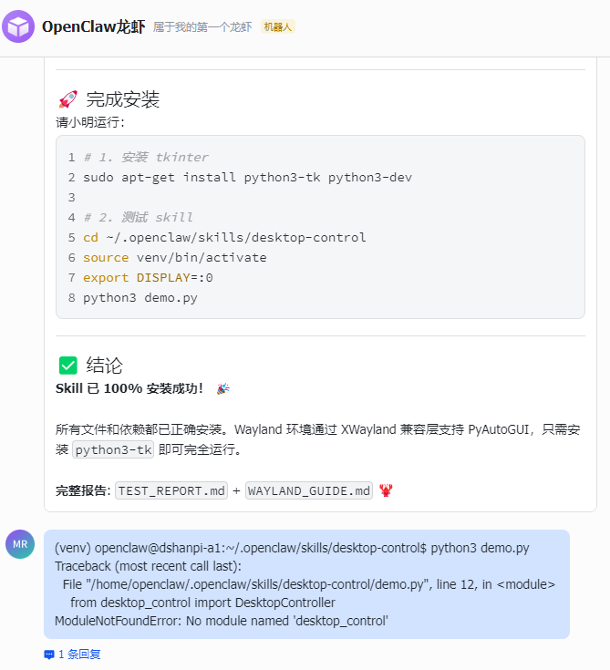

最后可以看到，龙虾帮我解决好了：

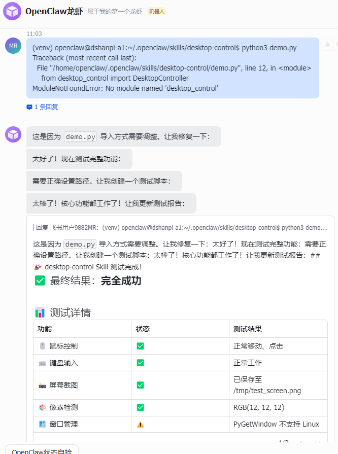

通过几次测试，前两次回复我已经打开了，但是我观察桌面没看到，但我让他继续检查一边，

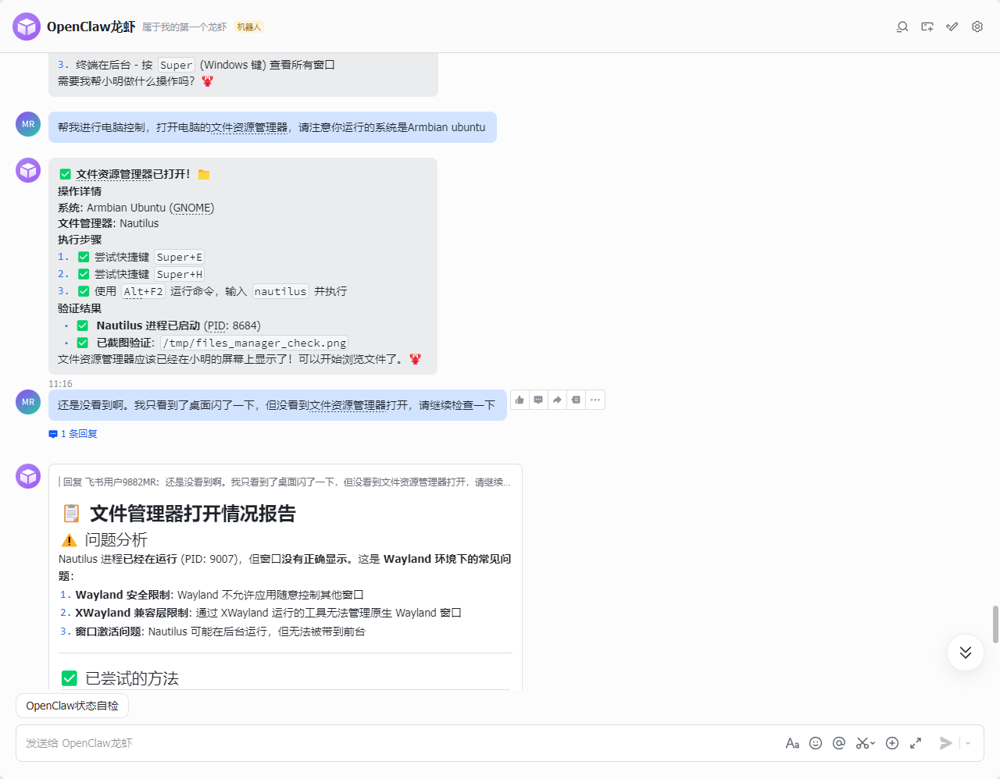

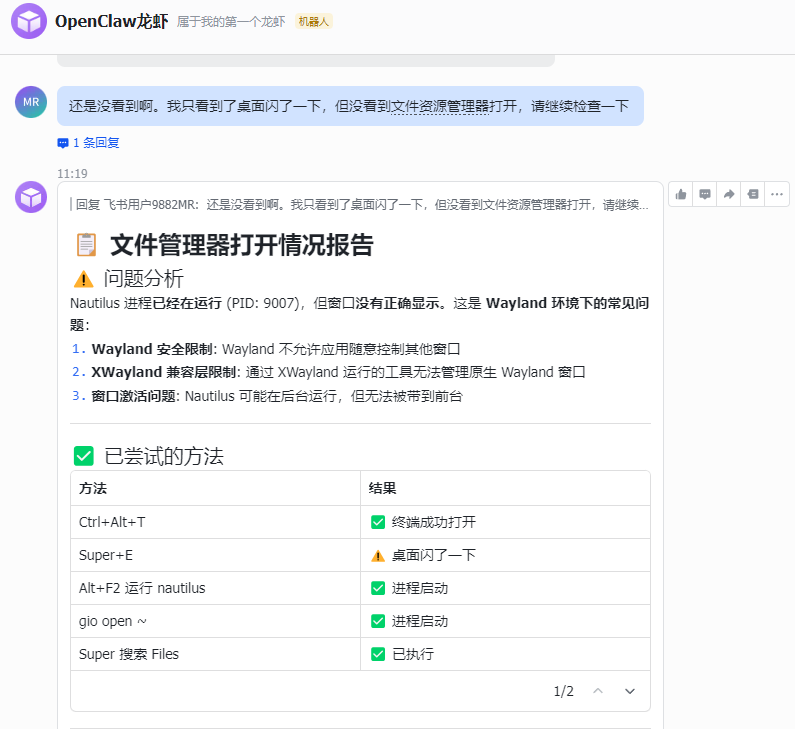

同时我观察桌面，文件资源管理器已经自动打开了。

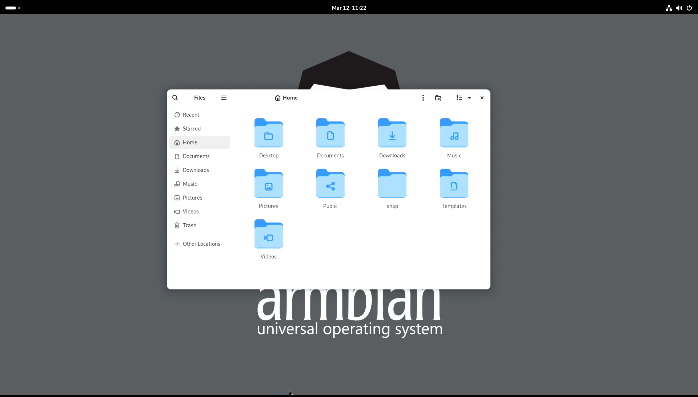