# 家庭总控助手Skill

开始前请确保已经安装好了OpenClaw！

- 下载Tuya Skill： [Tuya Sssistant Skill](https://images.tuyacn.com/content-platform/hestia/17727013499a021388050.zip) 
- 参考链接：[配置 Tuya Assistant Skill](https://developer.tuya.com/cn/docs/developer/tuya-assistant-skill?id=Kff30dlhqlfm5)


## 1.新增Tuya Skill

在openclaw的工作目录下新建`skills`文件夹，增加自定义skill。

```
baiwen@dshanpi-a1:~$ cd .openclaw/workspace/
baiwen@dshanpi-a1:~/.openclaw/workspace$ mkidr skills
baiwen@dshanpi-a1:~/.openclaw/workspace$ cd skills
```

将涂鸦skill拷贝至该目录下

```
baiwen@dshanpi-a1:~/.openclaw/workspace/skills$ ls
tuya-assistant
```


## 2.安装依赖

由于系统的python版本为python3.12，可执行下方里面安装python 虚拟机环境，如果不确定可执行python查看。

```
sudo apt install python3.12-venv
```

**创建虚拟环境:**

```
cd ~/.openclaw/workspace/skills/tuya-assistant && python3 -m venv venv
```

**安装依赖:**

```
source venv/bin/activate && pip install -r scripts/requirements.txt
```


## 3.注册 Skill

使用`skills`会自动扫描workspace命令扫描：

```
openclaw skills
```

运行结果如下：

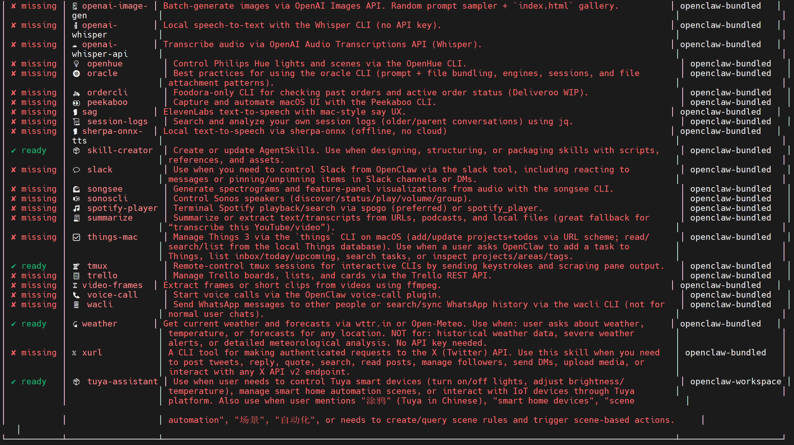


## 4.登录涂鸦云平台

访问涂鸦云平台：[https://platform.tuya.com/](https://platform.tuya.com/)

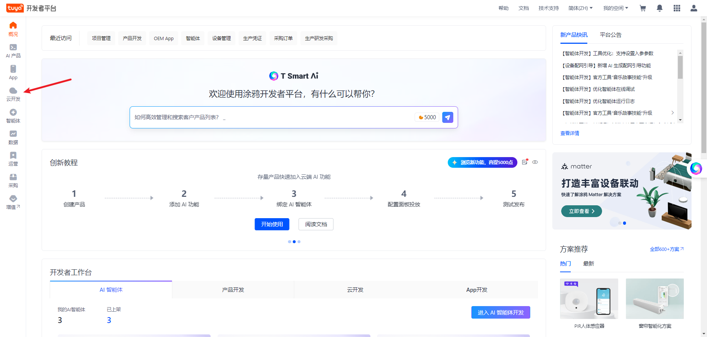

选择云开发。

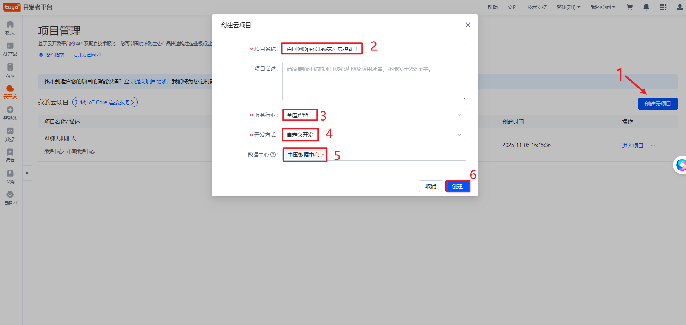

1. 创建云项目
2. 项目名称：随便填（如"百问网OpenClaw家庭总控助手"）

2. 行业：智能家居
3. 开发模式：自定义开发

填写完成后，点击`创建`。


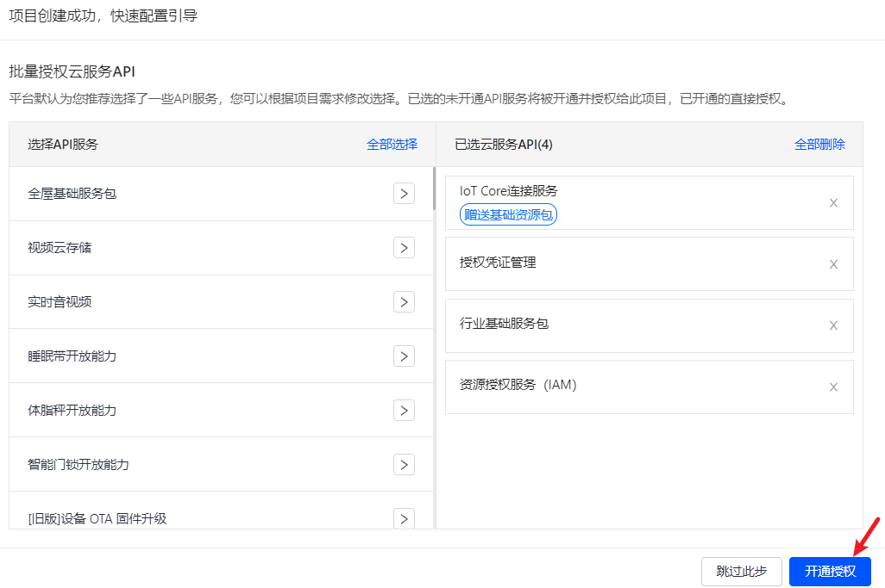

选择开通授权。

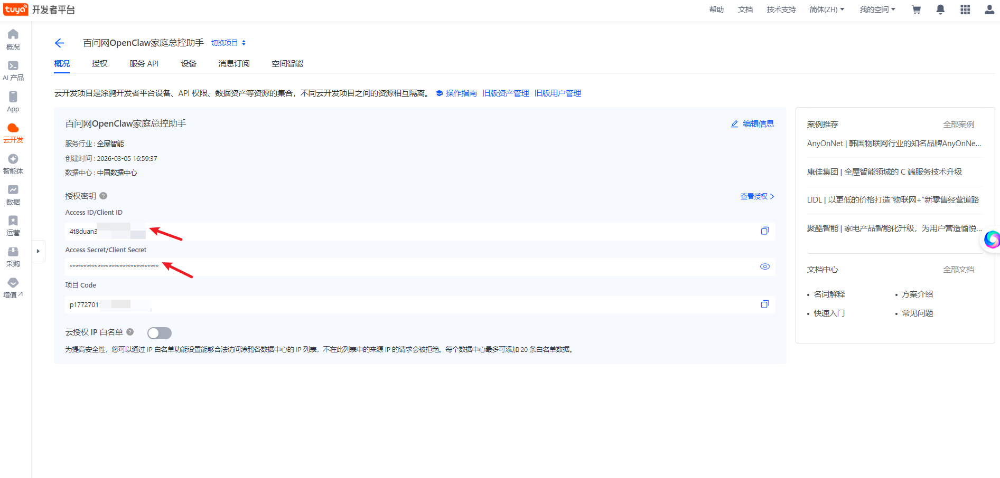

在这里就有我们需要的`Access ID`和`Access Secret`。请记录下这两个授权密钥，稍后我们会用到。

## 5.获取UID

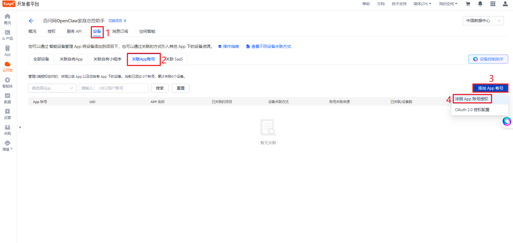

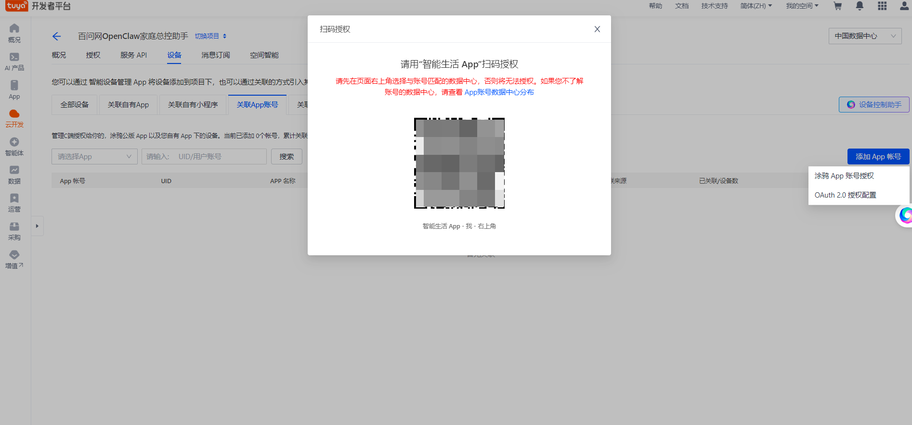

> 下载智能生活APP进行扫描，下载方式：
>
> 
>
> 您也可以在各大应用市场搜索“**智能生活/SmartLife”**下载使用。

扫码完成后,在APP端同意登录，后可以看到网页端会弹出设备关联方案，我们选择`自动关联`。

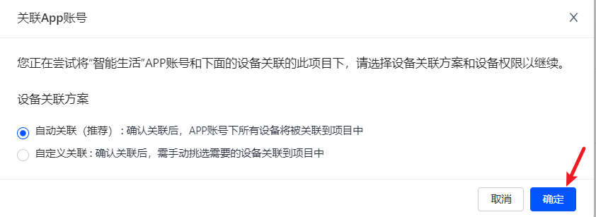

点击确认后会自动关联设备，等待自动关联后
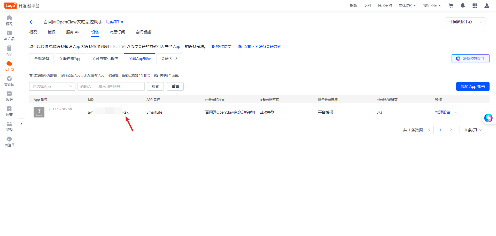

可以看到刚刚我们创建的项目`百问网OpenClaw家庭总控助手`,请记住上图中的UID,后续我们需要用到。

## 6.填写授权密钥

进入tuya skill目录：

```
cd ~/.openclaw/workspace/skills/tuya-assistant
touch config.env
```

填入密钥：

```
cat > config.env << 'EOF'
TUYA_ACCESS_ID=4t8xxxxxxxx5gqfe8
TUYA_ACCESS_SECRET=e6375319axxxxxxxxxxxxxxf3d0c9f
TUYA_UID=ay1766xxxxxxxxxkoRak
TUYA_ENDPOINT=https://openapi.tuyacn.com
EOF
```

请修改上面的`TUYA_ACCESS_ID`、`TUYA_ACCESS_SECRET`、`TUYA_UID`为您刚刚获取的密钥和ID。


## 7.使用APP连接灯带设备

开始前，请长按灯带上的按钮，让灯带处于红色灯闪烁状态。

连接2.4GHz的WIFI，打开蓝牙，再打开`智能生活`APP。

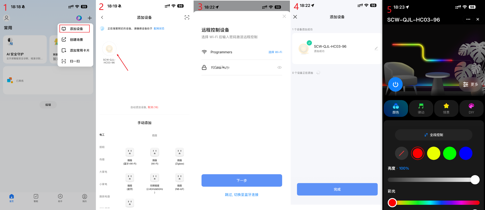

1. 点击右上角的`+`，选择添加设备
2. 等待扫描到的设备，扫描到设备后，点击设备。
3. 连接WiFi，选择连接到与手机连接的同一个WiFi。
4. 添加成功后，点击`完成`。
5. 添加成功后，会看到灯带设备的控制APP界面。

## 8.测试设备连接

在tuya skill目录下使用虚拟环境，测试设备状态：

```
cd ~/.openclaw/workspace/skills/tuya-assistant
source venv/bin/activate && source config.env
python scripts/tuya-cli.py devices
```

运行效果如下：

```
(venv) baiwen@dshanpi-a1:~/.openclaw/workspace/skills/tuya-assistant$ cd ~/.openclaw/workspace/skills/tuya-assistant
source venv/bin/activate && source config.env
python scripts/tuya-cli.py devices

🏠 Tuya Smart Device Control
========================================
2026-03-05 18:30:45,386 - scripts.tuya_manager - INFO - Using UID mode to query devices
2026-03-05 18:30:45,690 - scripts.tuya_manager - INFO - ✅ Successfully connected to Tuya IoT platform (UID mode)
2026-03-05 18:30:46,029 - scripts.tuya_manager - INFO - 📱 Found 4 device(s)

📱 Found 4 device(s):

============================================================
  1. SCW-XXL-XX03-96
     ID: 6c410xxxxxxxx8hgvk
     Product: SCW-XXL-XXX3-96
     Category: dd
     Status: True desc: 🟢 Online
     IP: xx.xx.xx.xx
     Timezone: +08:00
     Product ID: v1e8gtdgvnzxynai
     Product Name: SCW-QJL-HC03-96
     Current Status:
       • dpCode:switch_led  dpValue:True  dpValueType: bool  desc: ✅ ON
       • dpCode:work_mode  dpValue:colour  dpValueType: str  desc: colour
       • dpCode:colour_data  dpValue:{"h":0,"s":1000,"v":1000}  dpValueType: str  desc: {"h":0,"s":1000,"v":1000}
       • dpCode:countdown  dpValue:0  dpValueType: int  desc: 0
```


测试设备开启关闭：

```
#关闭设备
python scripts/tuya-cli.py control 6c410af05bebd6a1e8hgvk switch_led False
#开启设备
python scripts/tuya-cli.py control 6c410af05bebd6a1e8hgvk switch_led True
```


## 9.打开web UI

```
openclaw dashboard
```

访问`http://127.0.0.1:18789`，可以将测试设备开启关闭的LOG发给AI,让其学习，学习成功后即可控制灯的开关。

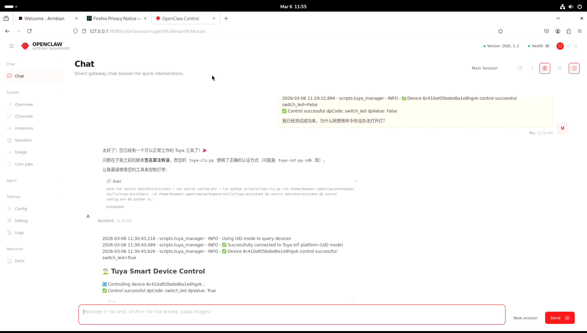

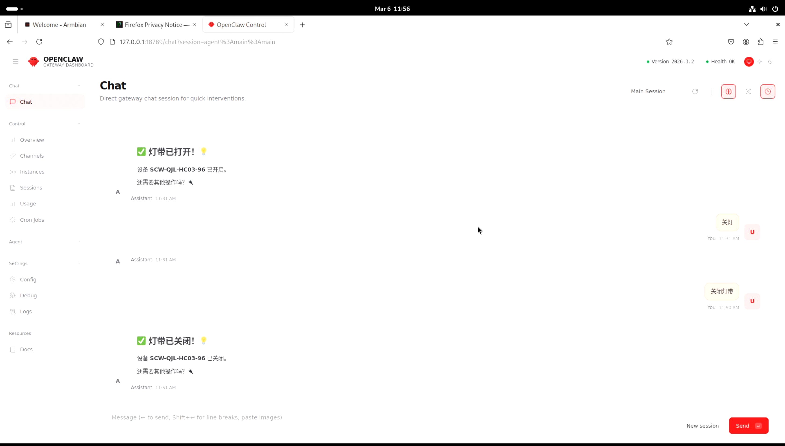

