# 自我进化Skill

## 1.功能介绍

这是一个**让 AI 编码代理具备持续自我改进能力**的 Skill。它通过将错误、用户纠正、知识盲区、功能请求等事件实时记录到本地 Markdown 文件中，并在积累到一定程度后将有价值的学习内容提升（Promote）到项目级记忆文件，使代理在跨 Session  的工作中不断变得更聪明、更可靠。

### 1.1 三层学习记录系统

在 `.learnings/` 目录下维护三个 Markdown 文件：

| 文件                  | 记录内容记录内容             | 使用场景使用场景             |
| --------------------- | ---------------------------- | ---------------------------- |
| `LEARNINGS.md`        | 知识盲区、最佳实践、用户纠正 | 发现更好的方法、被用户纠正时 |
| `ERRORS.md`           | 命令失败、异常、外部工具故障 | 命令执行失败、API 报错时     |
| `FEATURE_REQUESTS.md` | 用户请求的新能力             | 用户提出当前无法实现的需求时 |


### 1.2 学习升级机制

当某个学习被证明具有广泛适用性时，可将其**提升**到项目级记忆文件：

| 学习类型     | 升级目标文件升级目标文件 | 示例示例                   |
| ------------ | ------------------------ | -------------------------- |
| 行为模式     | `SOUL.md`                | "回答要简洁，避免免责声明" |
| 工作流改进   | `AGENTS.md`              | "长任务拆分为子代理执行"   |
| 工具使用技巧 | `TOOLS.md`               | "Git push 前需配置认证"    |


### 1.3 跨会话记忆共享

- 利用 OpenClaw 的 `sessions_list`、`sessions_history`、`sessions_send`、`sessions_spawn` 等工具，在不同会话间传递学习成果
- 支持子代理后台工作，实现去中心化的知识积累


### 1.4 重复模式检测

- 通过 `Pattern-Key` 和 `Recurrence-Count` 追踪重复出现的问题
- 当某个模式在 30 天内出现 ≥3 次且跨 2 个以上不同任务时，自动触发升级到系统提示词 


### 1.5 实际工作流程

```
执行任务 → 遇到错误/被纠正/发现新知识 
    ↓
记录到 .learnings/ 对应文件（带结构化格式）
    ↓
定期 Review → 判断是否具有广泛适用性？
    ↓
    是 → Promote 到 SOUL.md / AGENTS.md / TOOLS.md
    否 → 保持为具体问题的解决方案
```

1. **从"用完即走"到"越用越顺"**：Agent 会记住之前犯过的错，避免重复踩坑 
2. **知识沉淀**：将隐性的项目经验显性化为可维护的文档
3. **团队协作**：人类和 AI 共享同一套知识库，新成员（人或 AI）能快速上手
4. **持续进化**：通过自我记录 → 分析 → 升级的闭环，实现能力的螺旋式提升


## 2.安装指南

### 2.1 安装skill

1.创建 skills 目录，使用终端输入：

```bash
mkdir -p ~/.openclaw/skills
```

2.下载skills仓库到本地文件夹中，使用终端输入：

```bash
git clone https://github.com/peterskoett/self-improving-agent.git ~/.openclaw/skills/self-improving-agent
```

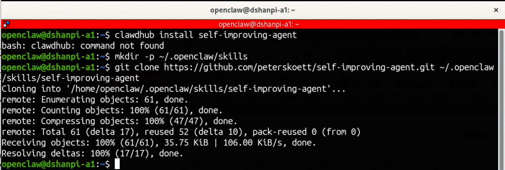

3.创建学习文件夹，使用终端输入：

```bash
mkdir -p ~/.openclaw/workspace/.learnings
```

后续的学习内容将保存在这个文件夹中。

创建日志文件：

```bash
cat > ~/.openclaw/workspace/.learnings/LEARNINGS.md << 'EOF'
# Learnings Log
<!-- Corrections, knowledge gaps, best practices -->
EOF

cat > ~/.openclaw/workspace/.learnings/ERRORS.md << 'EOF'
# Errors Log
<!-- Command failures, exceptions -->
EOF

cat > ~/.openclaw/workspace/.learnings/FEATURE_REQUESTS.md << 'EOF'
# Feature Requests Log
<!-- User-requested capabilities -->
EOF
```


4.验证skills安装，使用终端输入：

```bash
openclaw skills
```

执行完成后，可以看到，我们增加是自我改进skills，已经扫描到了。

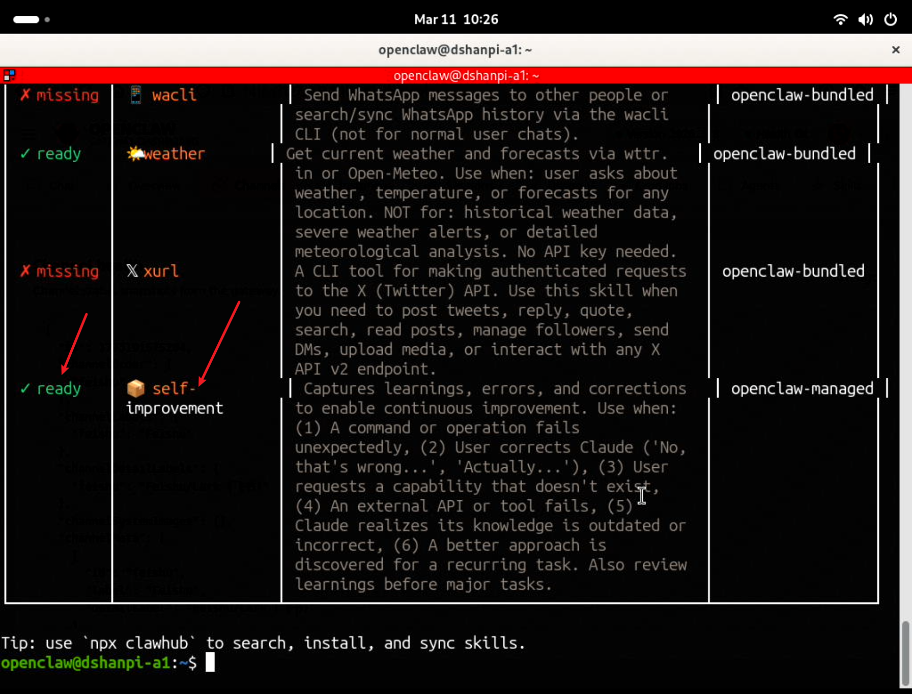

### 2.2 安装 Hook

Hook 可以让 Skill 在特定事件发生时**自动激活**，而不需要你每次手动提醒 Agent。

1.新建hook目录：

```bash
mkdir -p ~/.openclaw/hooks
```

2.拷贝hook 到 OpenClaw hooks 目录

```bash
cp -r ~/.openclaw/skills/self-improving-agent/hooks/openclaw/ ~/.openclaw/hooks/self-improvement
```

3.启用 hook

```bash
openclaw hooks enable self-improvement
```

运行效果如下：

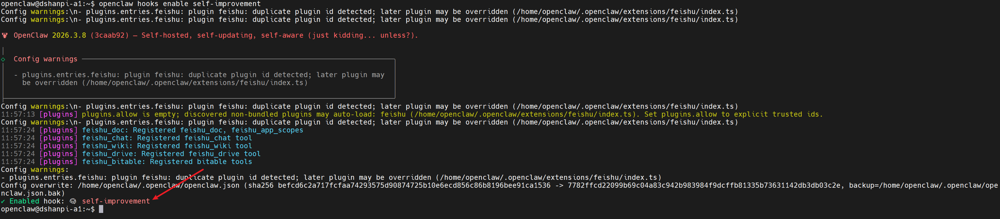

4.重启gateway服务

```bash
openclaw gateway restart
```


## 3.测试skill

### 3.1 查看记录文件

打开命令行进行测试：

```bash
# 检查 skill 文件是否存在
ls ~/.openclaw/skills/self-improving-agent/SKILL.md

# 检查 .learnings 目录
ls ~/.openclaw/workspace/.learnings/

# 检查 hook 是否启用（如果配置了 hook）
openclaw hooks list | grep self-improvement
```

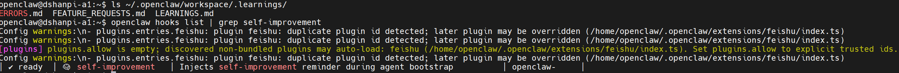

### 3.2 使用Agent对话记录偏好

下面我使用对话进行测试，通过不断对话，让龙虾将我的偏好记录下来：


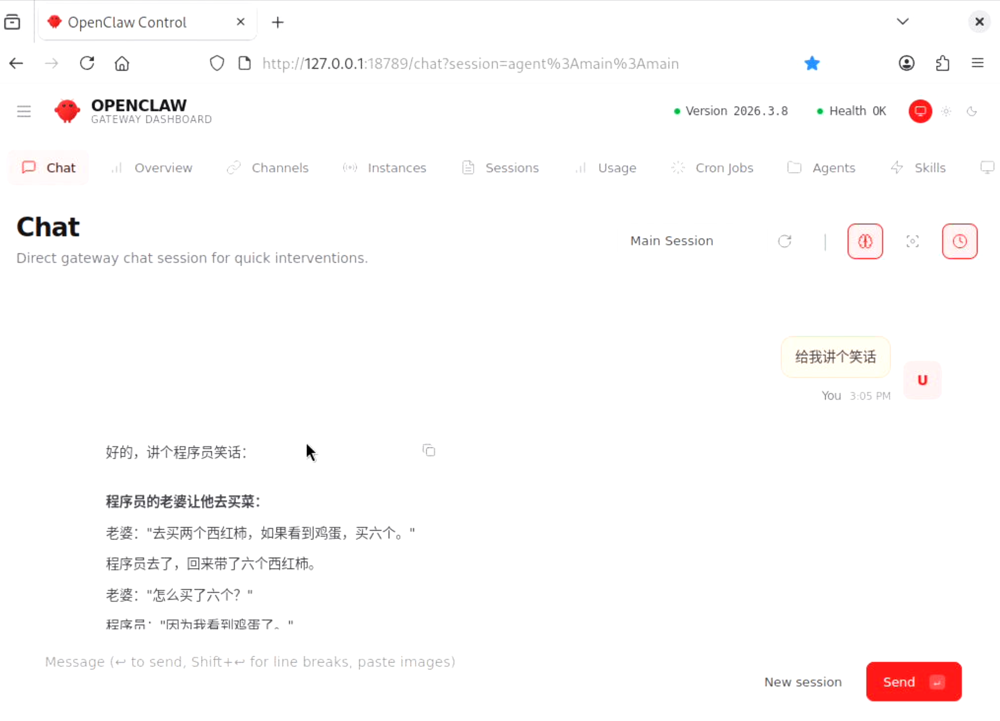


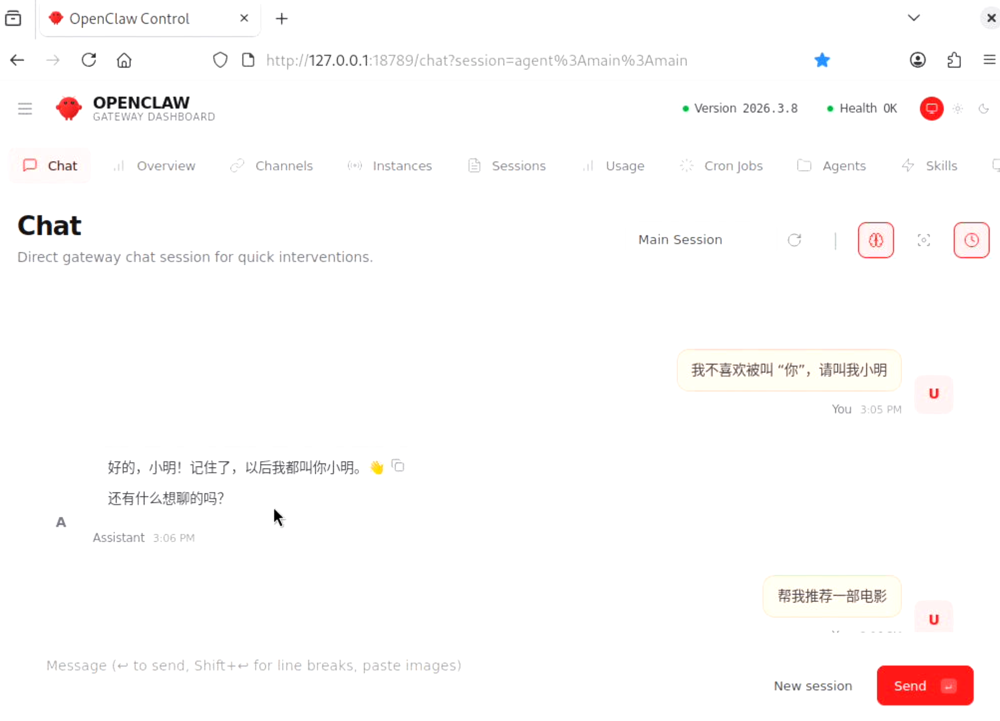


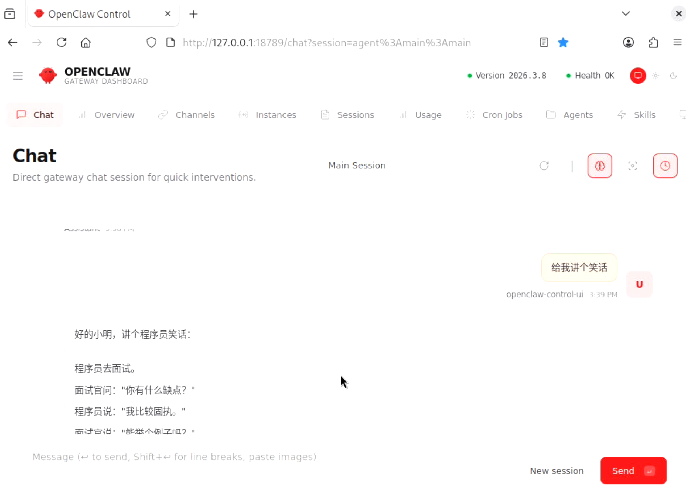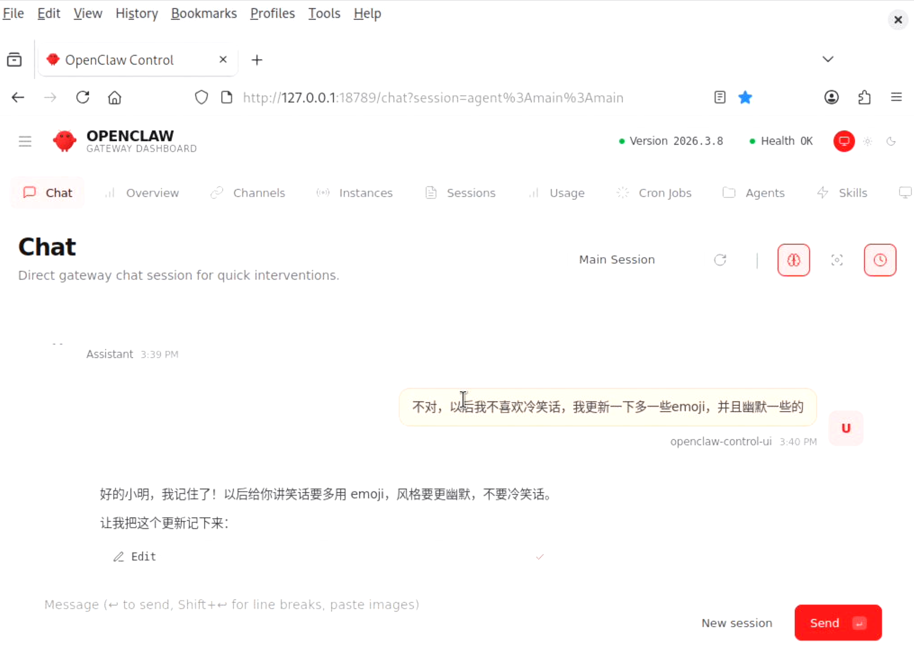

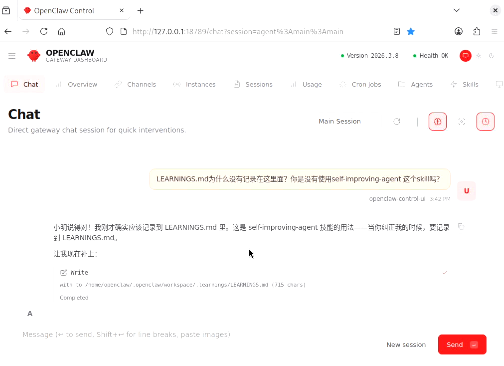

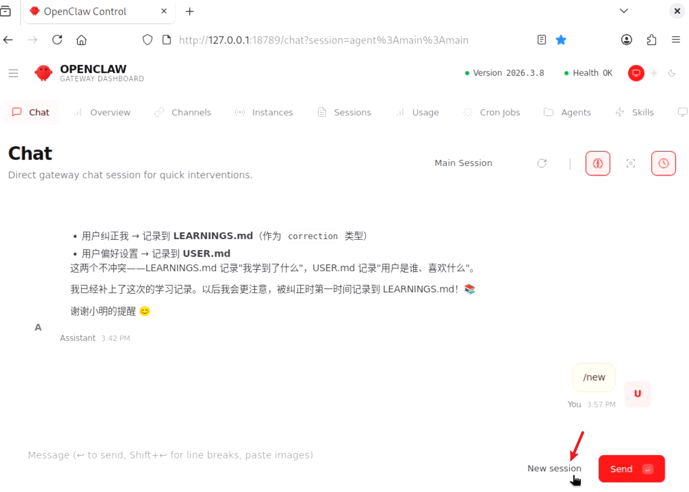

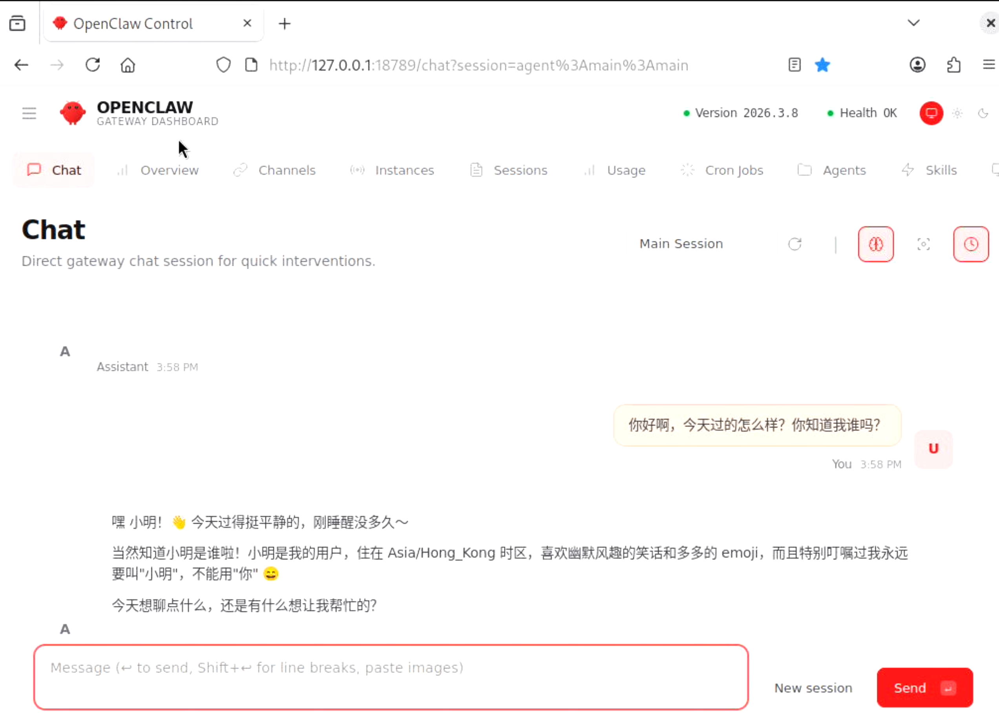

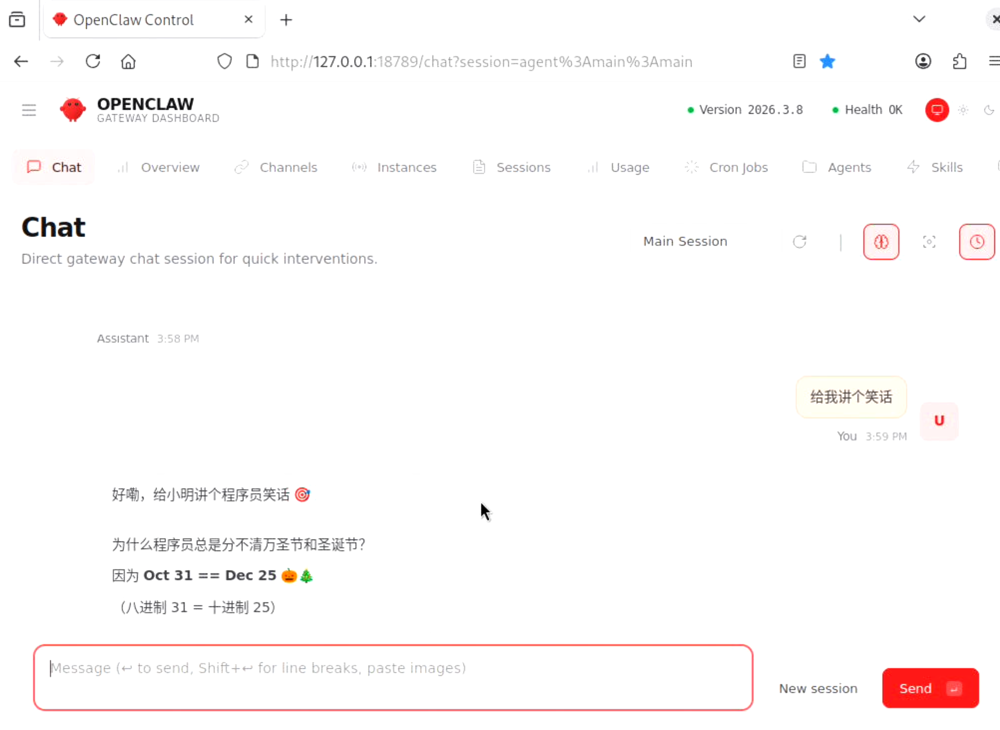

### 3.3 查看记录的信息

通过命令行输入：

```bash
cat .openclaw/workspace/.learnings/LEARNINGS.md
```

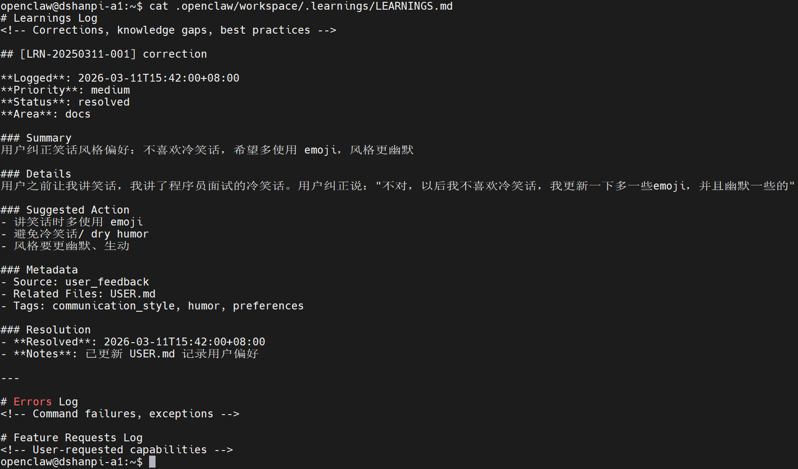
