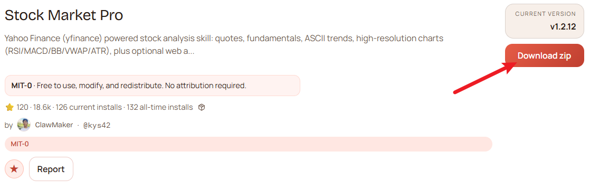
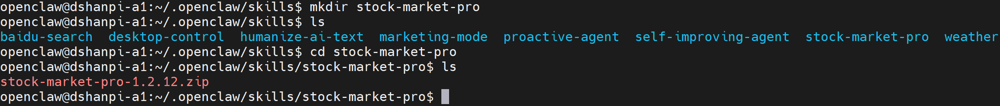
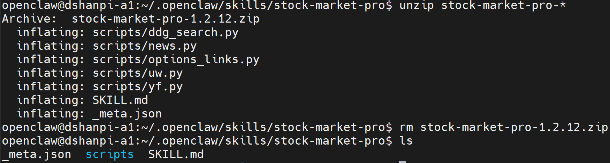
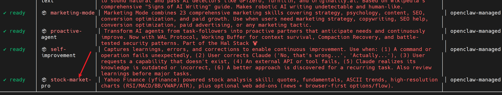
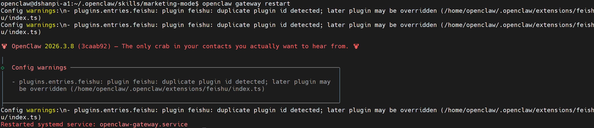
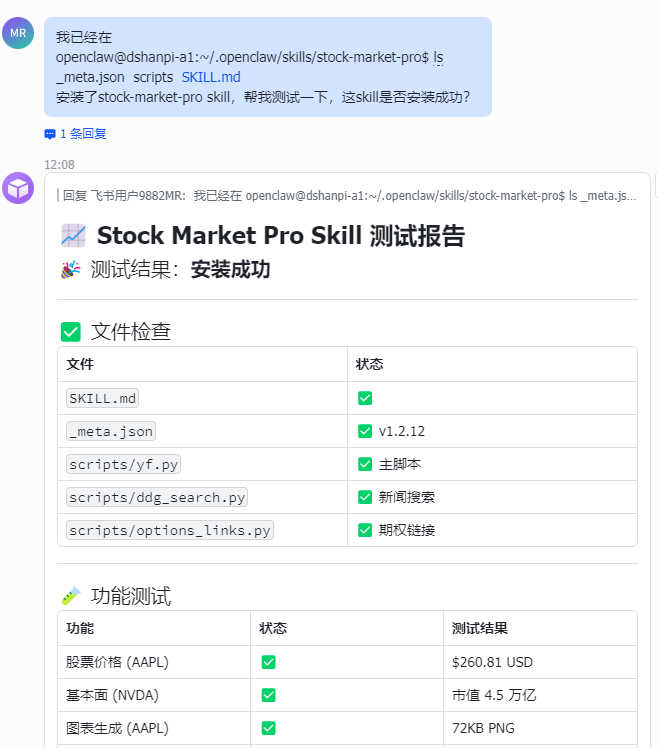
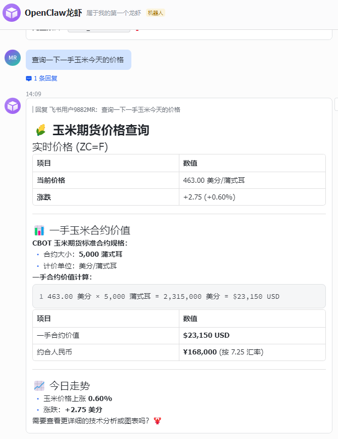

# OpenClaw增加股票市场分析

雅虎财经（yfinance）驱动股票分析技能：报价、基本面、ASCII趋势、高分辨率图表（RSI/MACD/BB/VWAP/ATR），以及可选的网页分析


## 1.安装

1.前往[stock-market-pro — ClawHub](https://clawhub.ai/kys42/stock-market-pro)点击下载获取压缩包，或者直接点击[Stock Market Pro](https://wry-manatee-359.convex.site/api/v1/download?slug=stock-market-pro)。




2.新建`stock-market-pro`文件夹，并将下载好的`stock-market-pro-1.2.12.zip`（后续版本可能不一样），拷贝至`marketing-mode`目录下。

```
#新建文件夹
mkdir stock-market-pro

#进入文件夹
cd stock-market-pro

#拷贝压缩包至该目录下
```




3.解压压缩包

```
#解压压缩包
unzip stock-market-pro-*

#解压完成后，删除压缩包
rm stock-market-pro-1.2.12.zip
```



4.安装uv工具

```
curl -LsSf https://astral.sh/uv/install.sh | sh
```


4.扫描Skills

```
openclaw skills
```




5.重启openclaw gateway

```
openclaw gateway restart
```




## 2.测试

直接想Web UI的对话页面或者飞书对话界面，直接提问： 

```
我已经在
openclaw@dshanpi-a1:~/.openclaw/skills/stock-market-pro$ ls
_meta.json  scripts  SKILL.md
安装了stock-market-pro skill，帮我测试一下，这skill是否安装成功？
```



