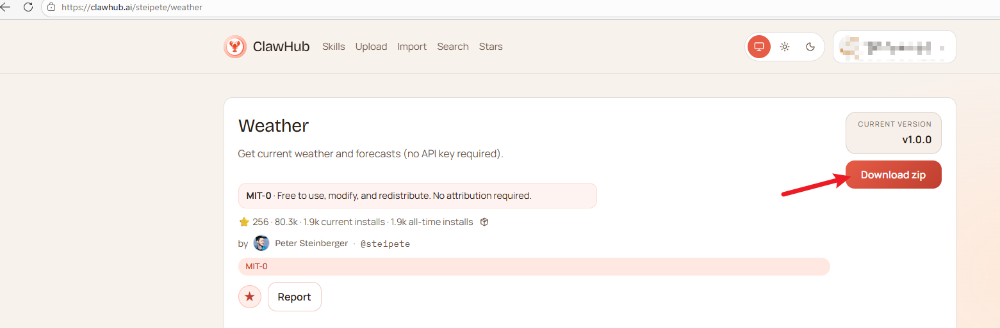
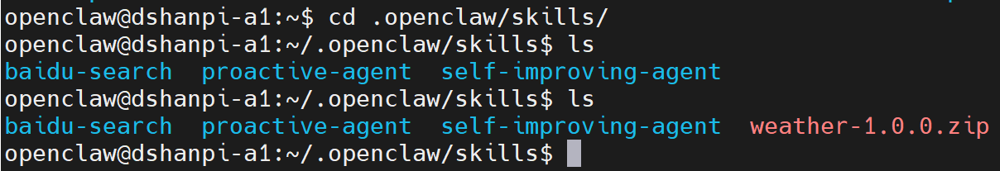
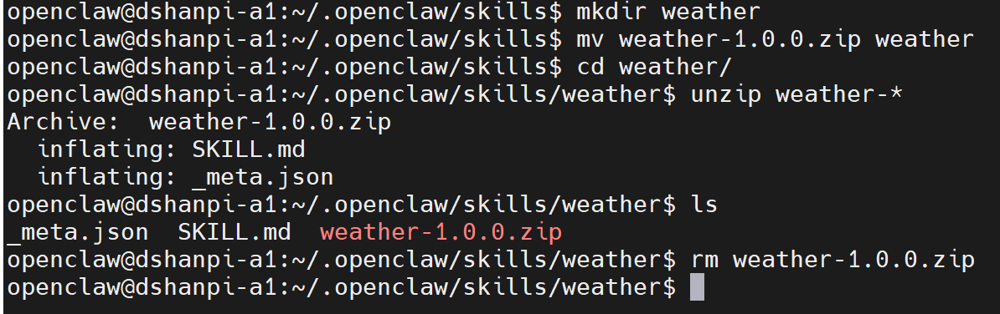
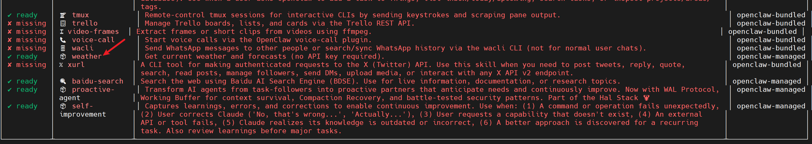
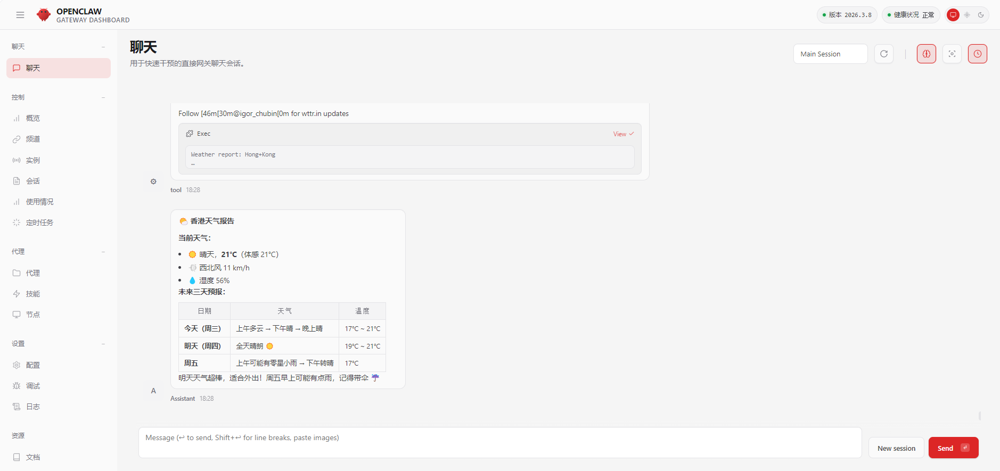

# OpenClaw增加天气查询

参考资料:[Weather — ClawHub](https://clawhub.ai/steipete/weather)

作用：获取当前天气和预报

## 1.安装

1.访问SKill网址下载[Weather — ClawHub](https://clawhub.ai/steipete/weather)，或者直接点击下载[天气查询](https://wry-manatee-359.convex.site/api/v1/download?slug=weather)Skill技能包



2.拷贝至`.openclaw/skills`目录下：




3.新建文件夹并解压压缩包：

```
#新建文件夹
mkdir weather

#移动压缩包
mv weather-* weather

#进入天气查询skill目录
cd weather/

#解压当前目录的压缩包
unzip weather-*

#删除压缩包
rm weather-1.0.0.zip
```




4.查看skills

```
openclaw skills
```




5.重启gateway

```
openclaw gateway restart
```


## 2.测试

直接在Web UI提问`使用weather skill查询天气`:

