# 百度网络搜索Skill

- 参考资料：[baidu web search — ClawHub](https://clawhub.ai/ide-rea/baidu-search)

## 1.安装

1.下载百度网络搜索Skill技能包：https://wry-manatee-359.convex.site/api/v1/download?slug=baidu-search

下载完成后，将其拷贝至`.openclaw/skills`目录下：

```
openclaw@dshanpi-a1:~/.openclaw/skills$ ls
baidu-search-1.1.1.zip
```

> 注意：压缩包后面的版本号，后续可能会更新，请根据自己下载的版本进行修改。

2.在`.openclaw/skills`目录下新建`baidu-search`文件夹：

```
mkdir baidu-search
```

拷贝压缩包至`baidu-search`目录下。

```
mv baidu-search-1.1.1.zip baidu-search
```

进入`baidu-search`目录下

```
cd baidu-search/
```

3.解压skill压缩包：

```
unzip baidu-search-1.1.1.zip
```

删除压缩包

```
rm baidu-search-1.1.1.zip
```

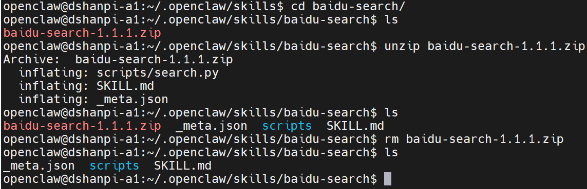

4.重新扫描skills

```
openclaw skills
```

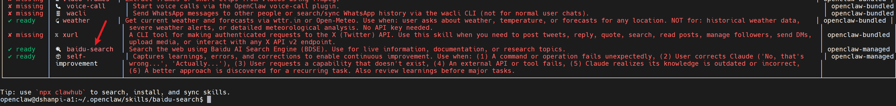

重启openclaw gateway:

```
openclaw gateway restart
```


## 2.测试

### 2.1 获取百度 API Key

前往 [百度智能云](https://cloud.baidu.com/)  登录账号。进入[API key](https://console.bce.baidu.com/qianfan/ais/console/apiKey)申请界面。

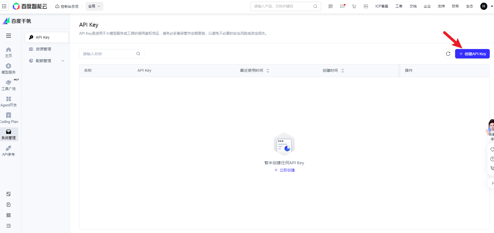

点击**创建API Key**

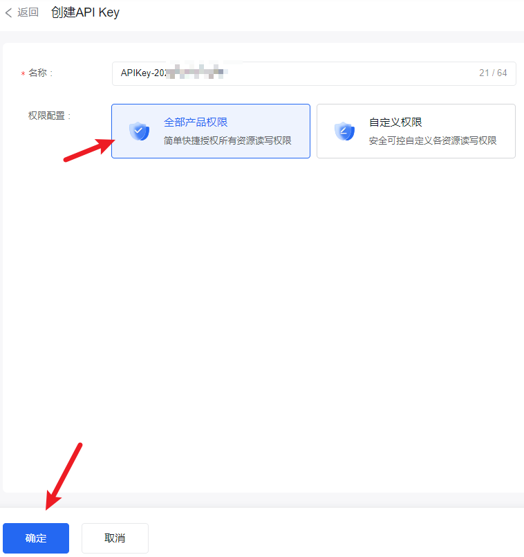

选择**全部权限**，点击**创建**。

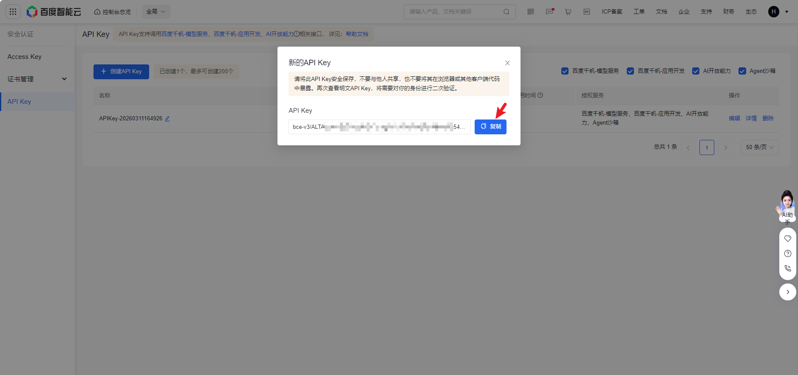

创建成功后可以看到API Key。后续可以在[剩余次数](https://console.bce.baidu.com/qianfan/studio/resource)，不用开通后付费。


### 2.2 获取百度 SecretKey

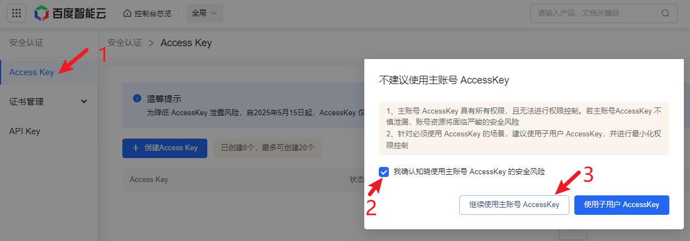

点击`Access key`，确认安装风险后，继续**使用主账号的AccessKey**。

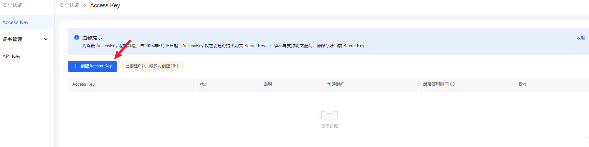

点击**创建Access Key**，安装提示进行安全验证。

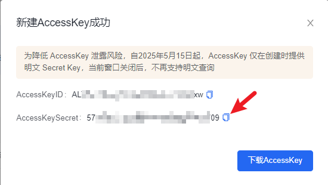

验证完成后，我可以获取`AccessKeySecret`。

### 2.3 设置环境变量

**临时设置环境变量：**

```
export BAIDU_API_KEY="你的API Key"
export BAIDU_SECRET_KEY="你的SecretKey"
```

执行测试命令：

```
python3 scripts/search.py '{"query":"人工智能"}'
```

运行效果：
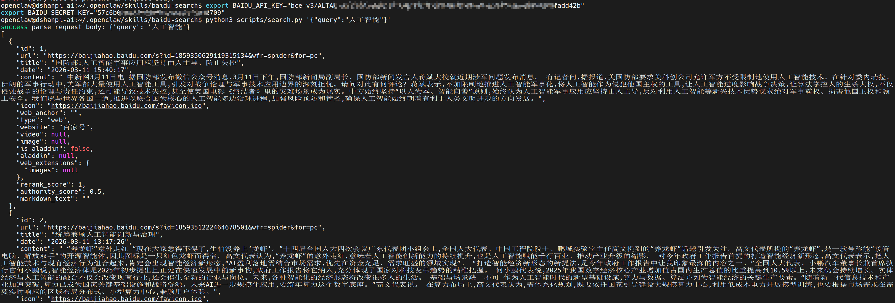


**永久配置环境变量：**

修改环境变量：

```
vi ~/.bashrc
```

在文档末尾添加：

```
export BAIDU_API_KEY="你的APIKey"
export BAIDU_SECRET_KEY="你的SecretKey"
```

添加完成后激活环境变量：

```
source ~/.bashrc
```


### 2.4 命令示例

```
# Basic search
python3 scripts/search.py '{"query":"人工智能"}'

# Freshness first format "YYYY-MM-DDtoYYYY-MM-DD" example
python3 scripts/search.py '{
  "query":"最新新闻",
  "freshness":"2025-09-01to2025-09-08"
}'

# Freshness second format pd、pw、pm、py example
python3 scripts/search.py '{
  "query":"最新新闻",
  "freshness":"pd"
}'

# set count, the number of results to return
python3 scripts/search.py '{
  "query":"旅游景点",
  "count": 20,
}'
```


## 2.5 使用Agent进行测试

直接提问`使用百度搜索 搜索一个关于openclaw的笑话`

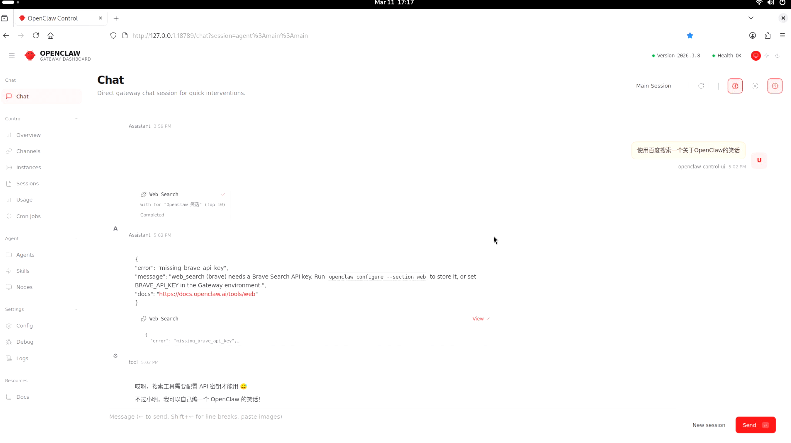

此时它会提示我需要配置API 密钥，我们直接这段话发给它即可。

```
export BAIDU_API_KEY="你的APIKey"
export BAIDU_SECRET_KEY="你的SecretKey"
```

如果不行，请把你之前的通过命令测试好的LOG发给他，同样也可以配置成功。

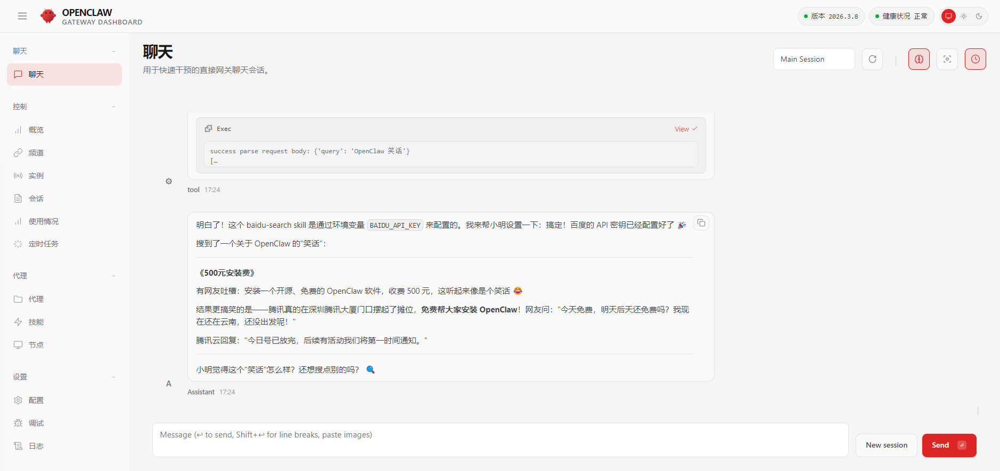
