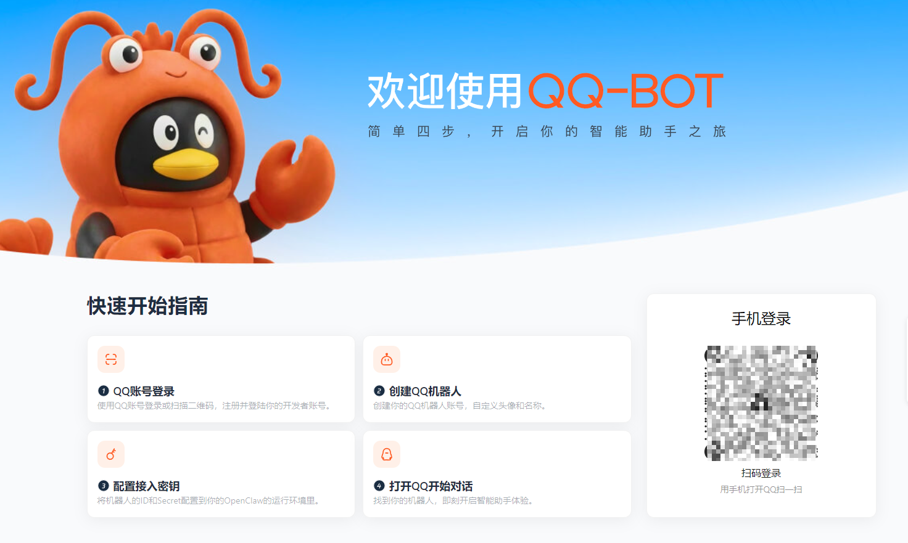
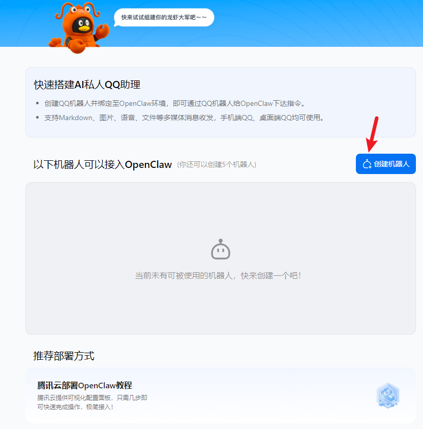
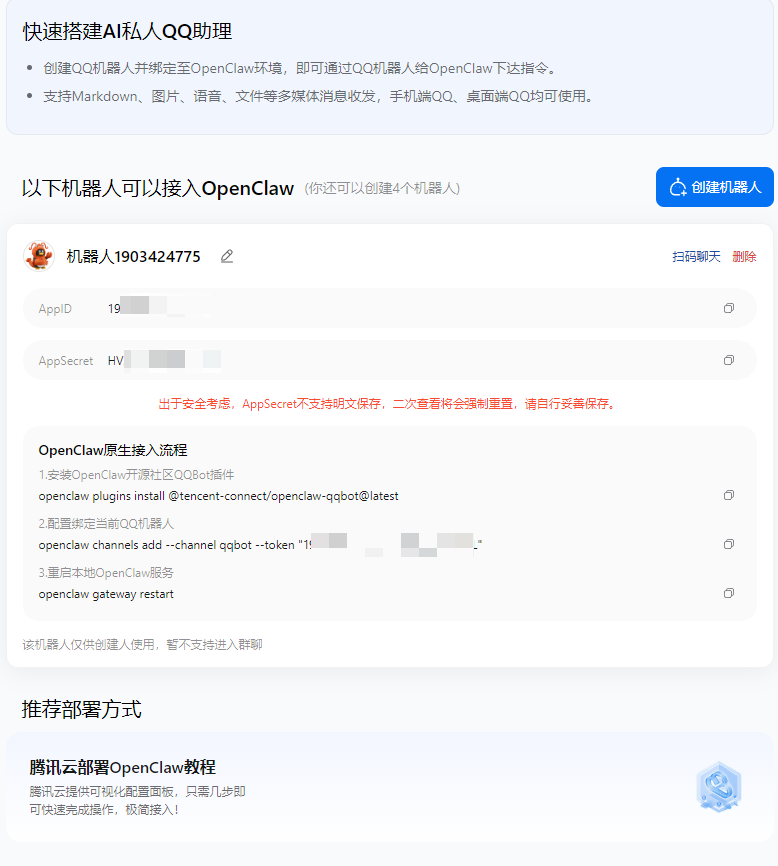
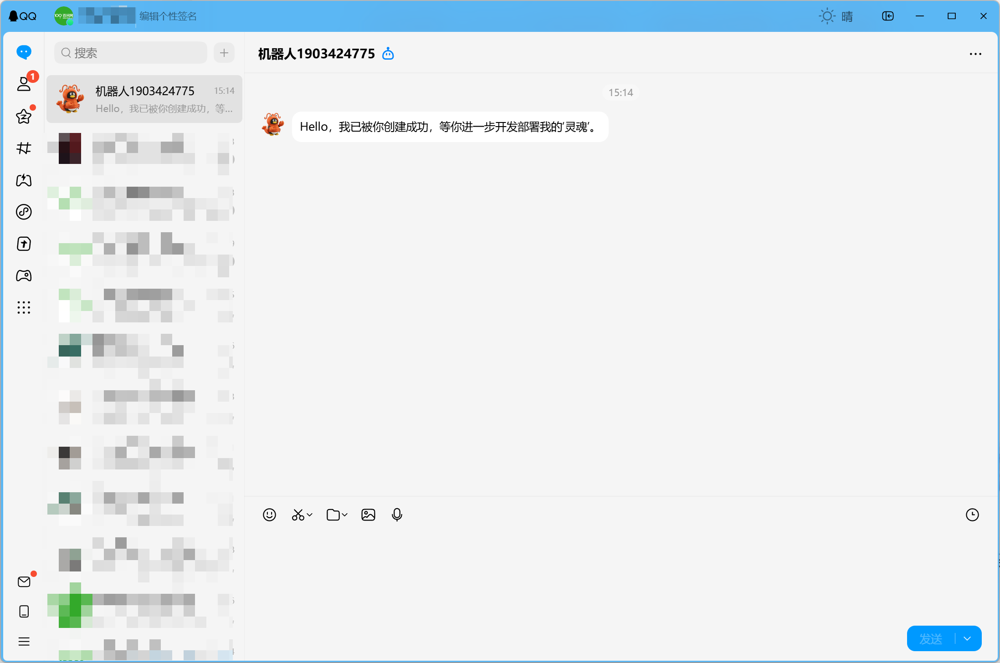
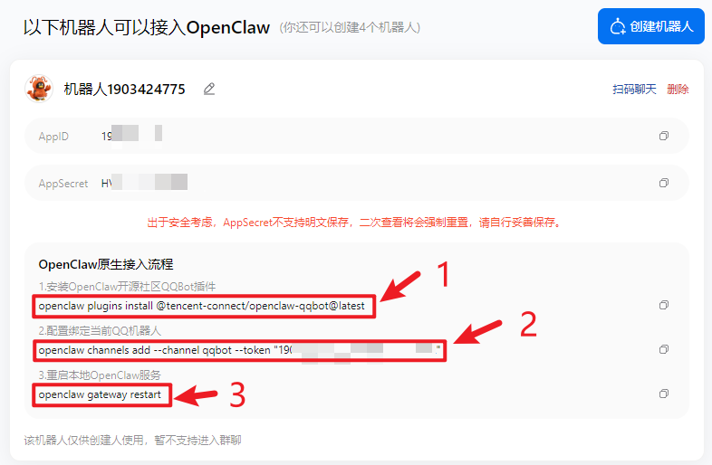
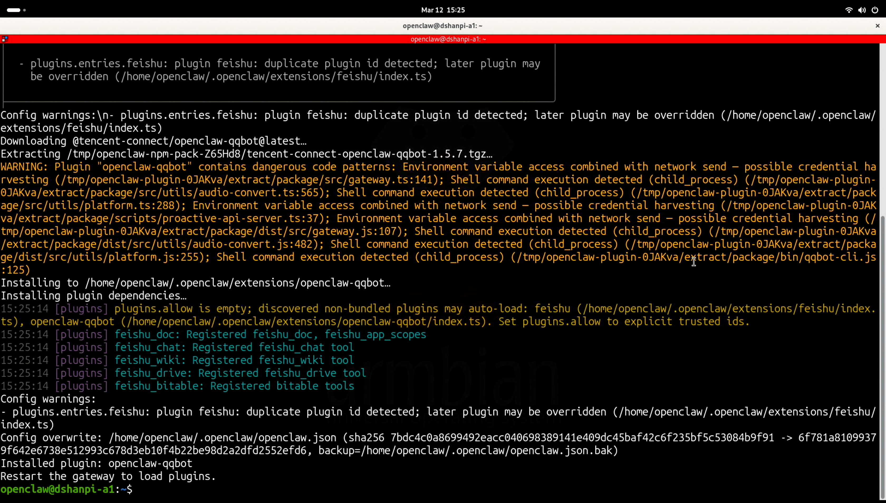
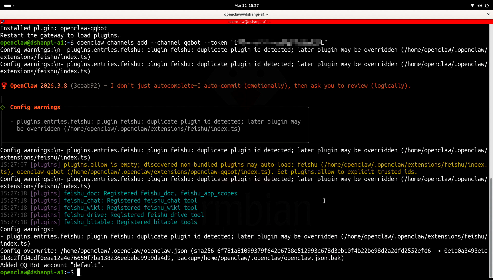
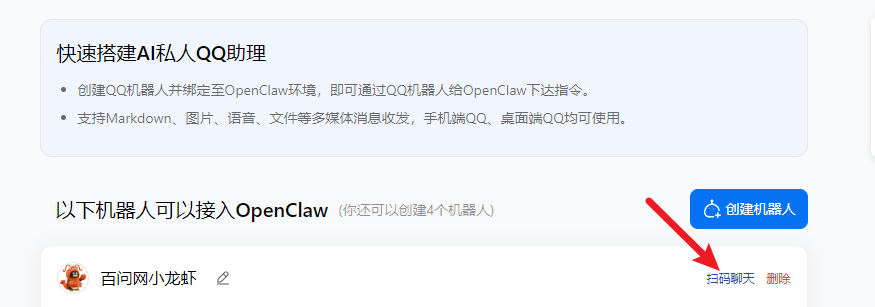
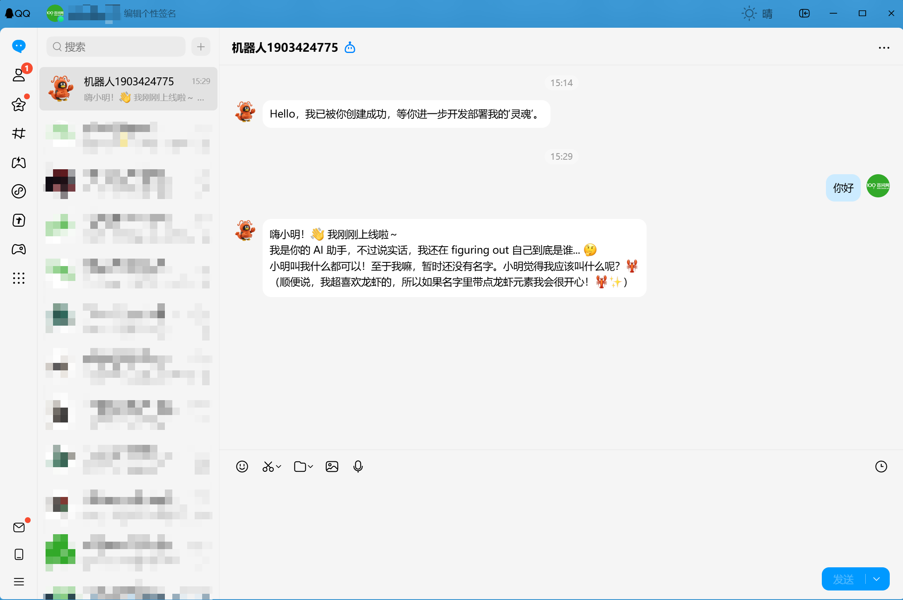

# OpenClaw接入QQ

## 1.创建QQ BOT

打开 QQ 官方机器人入口：https://q.qq.com/qqbot/openclaw/login.html



可以看到这个界面，扫码注册开发者账号。



扫码完成后可以看到以上界面，点击**创建机器人**。



创建成功后，有看到生成的AppID和AppSecret,请记住这两个。并且还提供了后面再OpenClaw中执行的命令。同时机器人还会给你注册开发者账号的QQ发送一条信息。




## 2.配置OpenClaw

回到OpenClaw主机界面,根据QQ Bot界面提供的命令进行执行：



打开终端，**安装OpenClaw开源社区QQBot插件**，输入：

```
openclaw plugins install @tencent-connect/openclaw-qqbot@latest
```




**配置绑定当前QQ机器人**，输入：

```
openclaw channels add --channel qqbot --token "19xxxxxx:HVxxxxxxxxx"
```

上面的token需要根据你QQ Bot界面提供的token而修改！！！




**重启本地OpenClaw服务**，输入：

```
openclaw gateway restart
```

## 3.测试

打开 QQ，找到对应的机器人，可以向他发送消息。或者点击QQ Bot界面的扫码聊天。



例如：你好。如果配置成功了，OpenClaw会回复你。



