# 接入企业微信机器人

- 参考资料：https://work.weixin.qq.com/nl/index/openclaw


## 1.创建智能机器人

打开[企业微信](https://work.weixin.qq.com/)，找到工作台中的智能机器人。

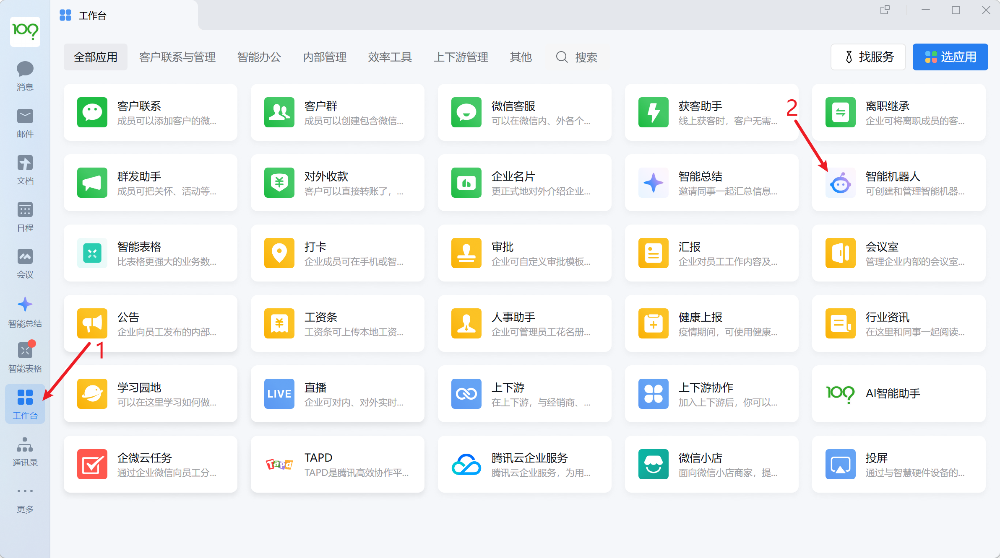


选择**创建机器人**

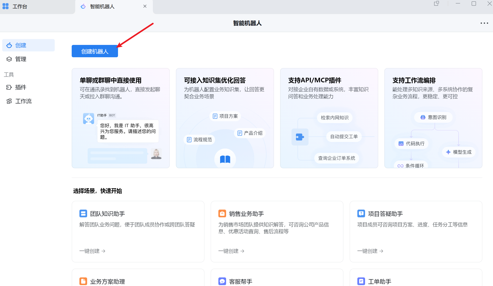

选择**手动创建**。

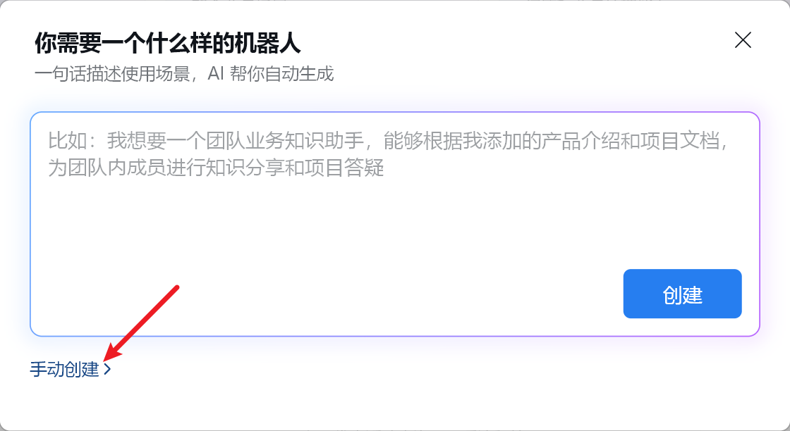

往下找到**API模型创建**。

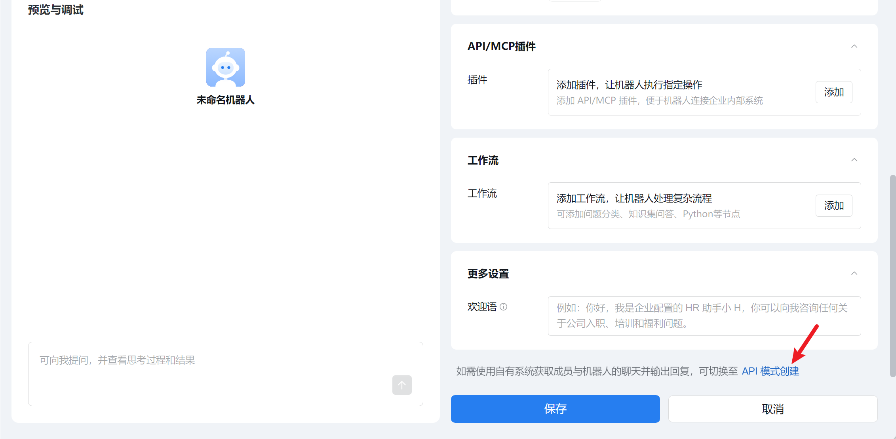

选择连接方式为：**使用长连接**，并**点击获取Secret**。

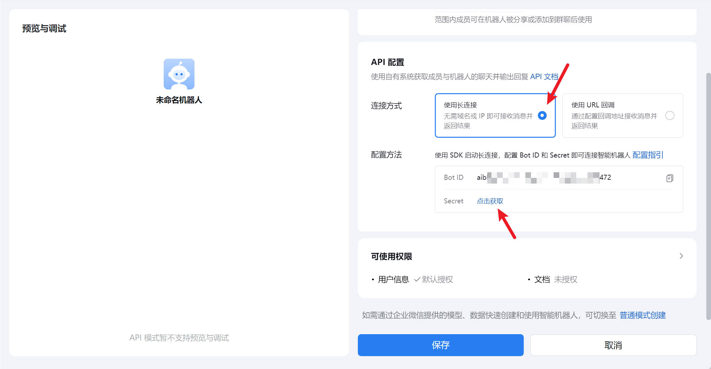

请记住获取的Bot ID和Secret，后续我们会使用到。

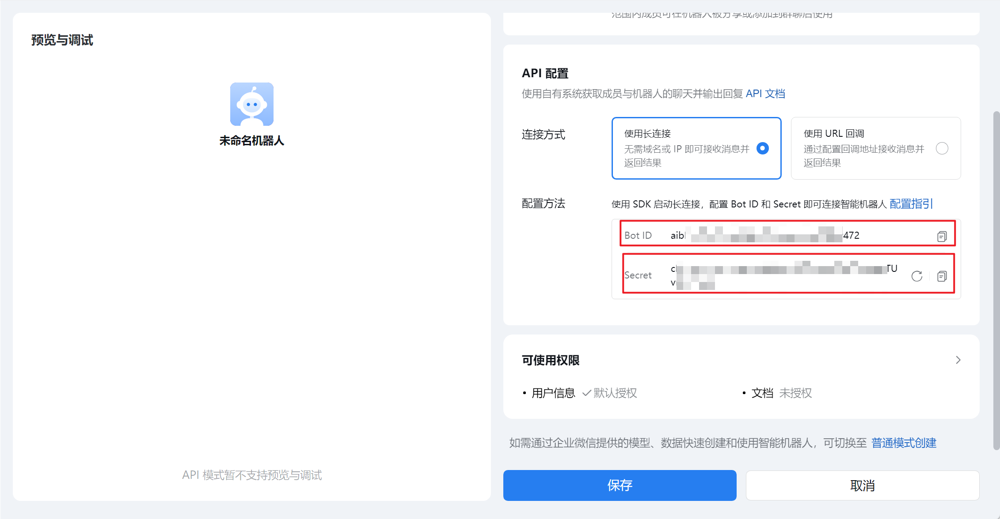

最后可修改机器人名称完成后，点击保存。

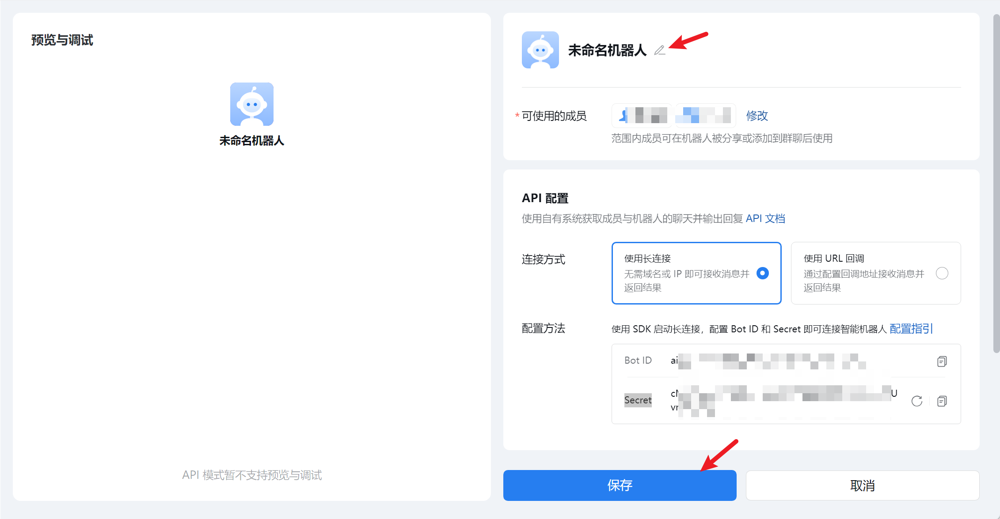

保存完成后可以看到如下界面。

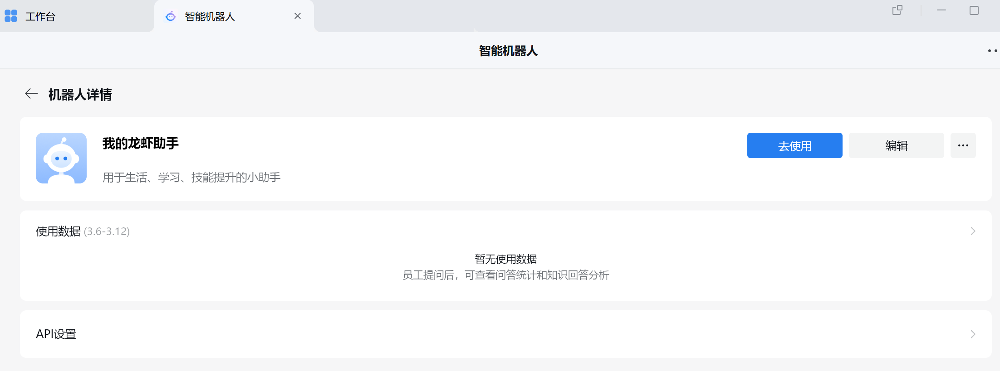


## 2.OpenClaw配置

1.在本地搜索打开终端，输入以下命令，安装企微插件。

```
openclaw plugins install @wecom/wecom-openclaw-plugin
```

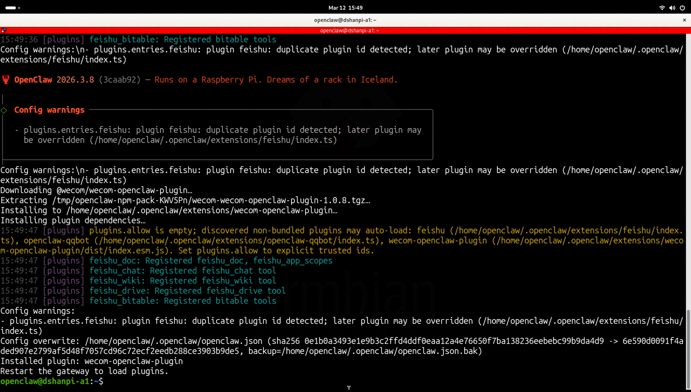

2.重启OpenClaw

```
openclaw gateway restart
```

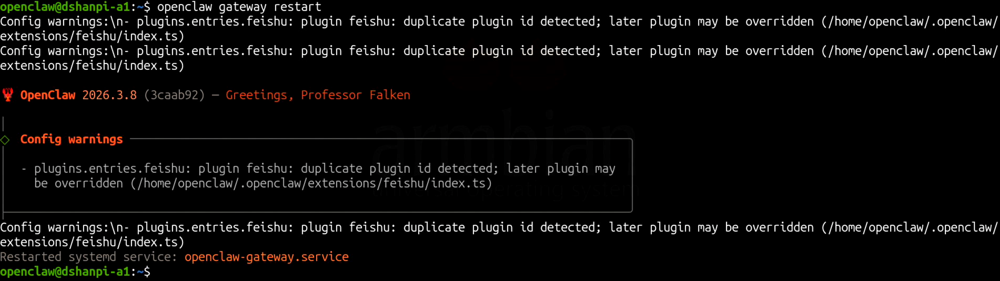


3.添加企业微信通道

```
openclaw channels add
```

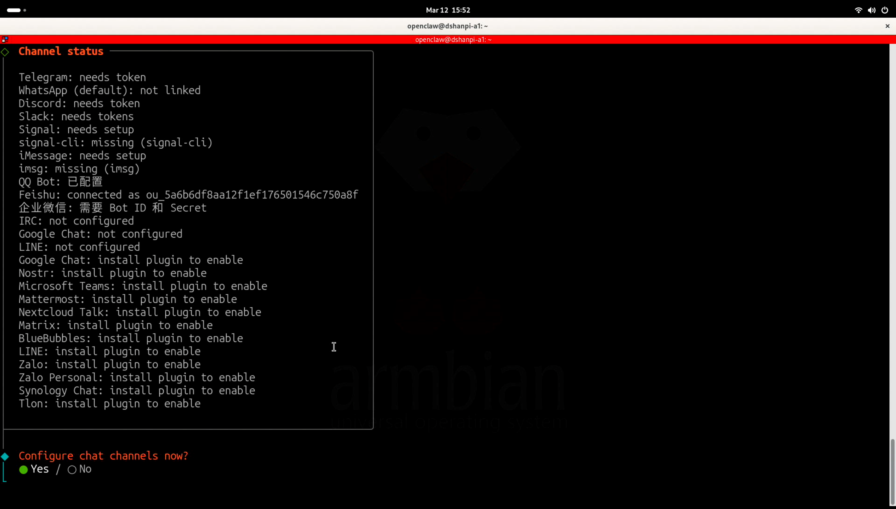

选择**Yes**，现在配置聊天通道。

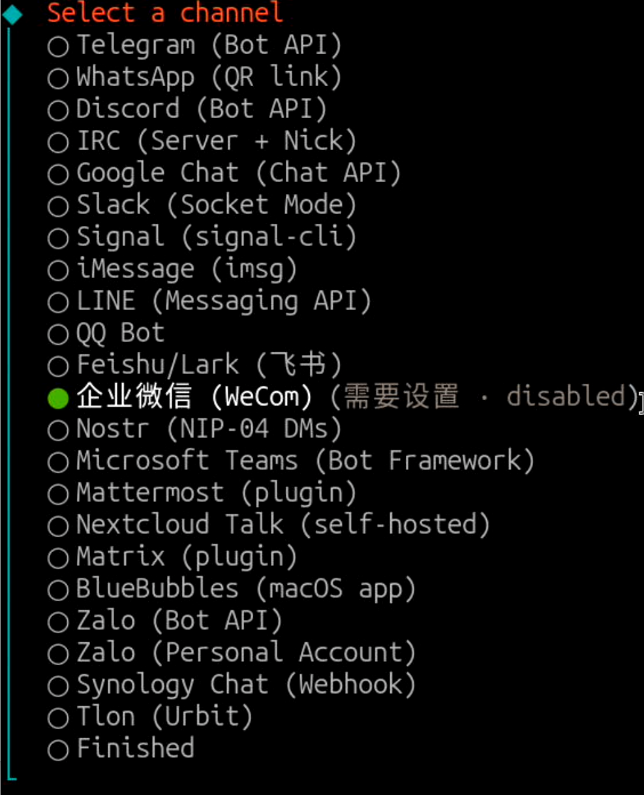

使用方向键选择**企业微信(WeCom)**，选择完成后按下回车键。

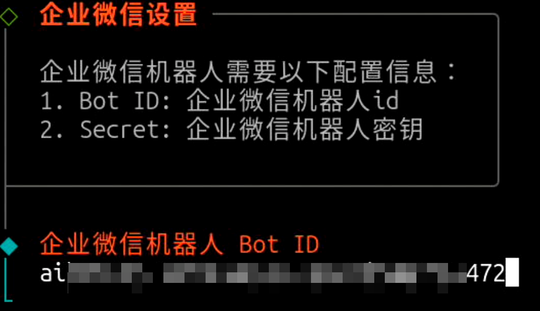

填入刚刚再创建智能机器人的Bot ID。

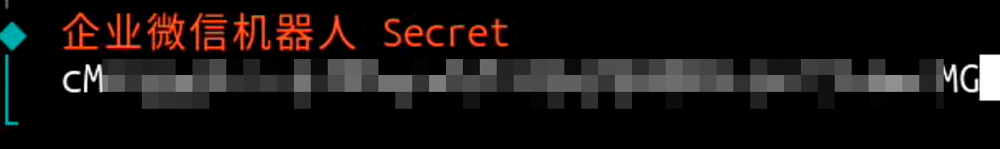

填入刚刚再创建智能机器人的Secret。

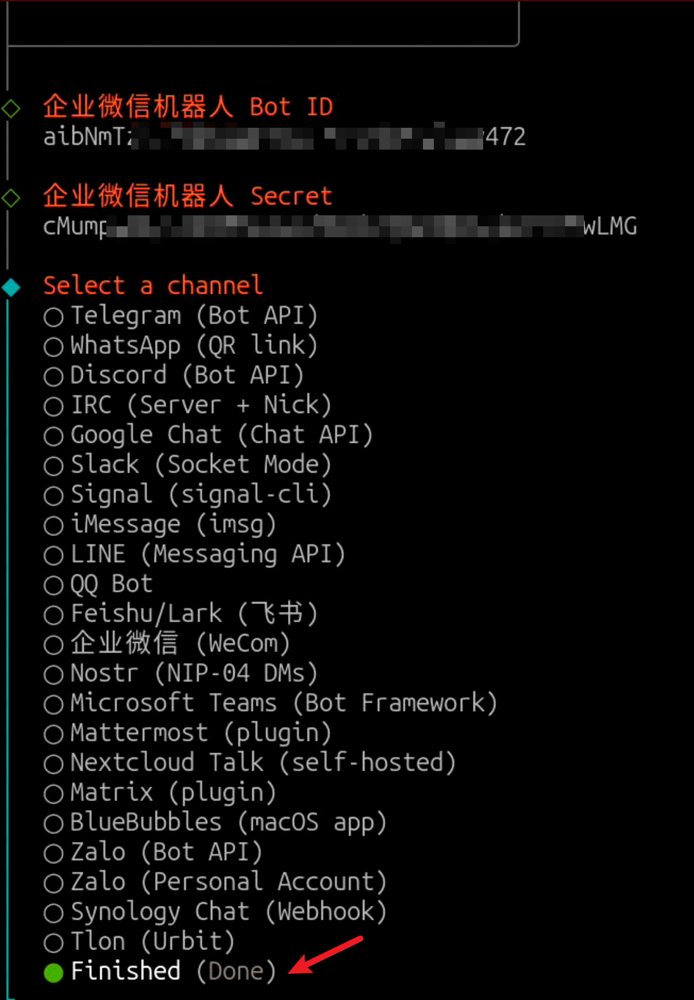

最后选择**Finished**。

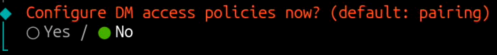

选择**No**,使用Pairing的方式，即配对码的方式。

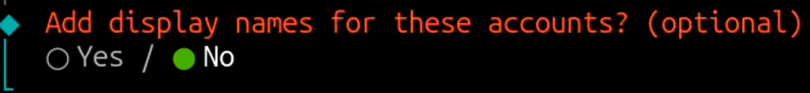

选择**No**。


## 3.测试

在智能机器人界面，点击 **去使用**。

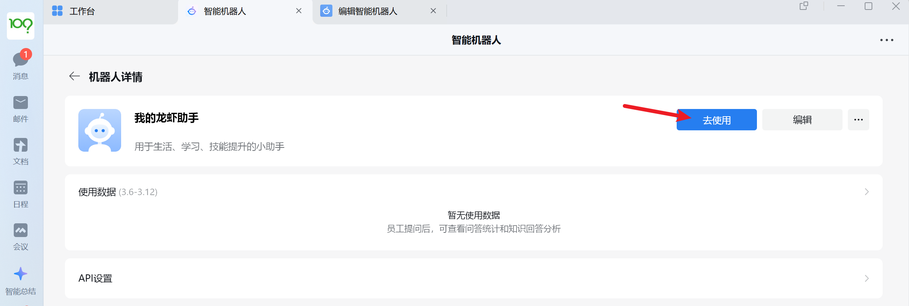

点击**发信息**：

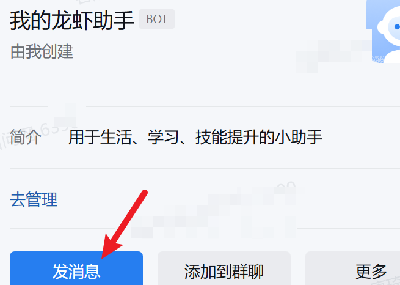

发送信息，例如：你好

如果配置成功，OpenClaw会给您回复配对码，即Pairing code后的配对码。

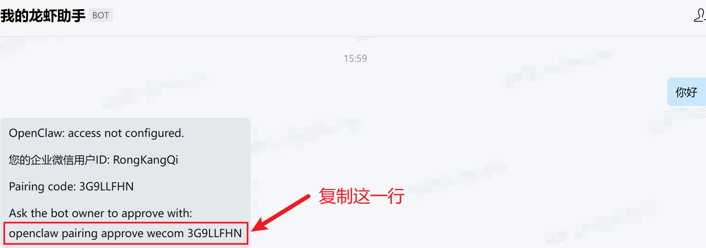

复制OpenClaw发给您的最后一行，前往OpenClaw执行。这里我复制的是：

```
openclaw pairing approve wecom 3G9LLFHN
```

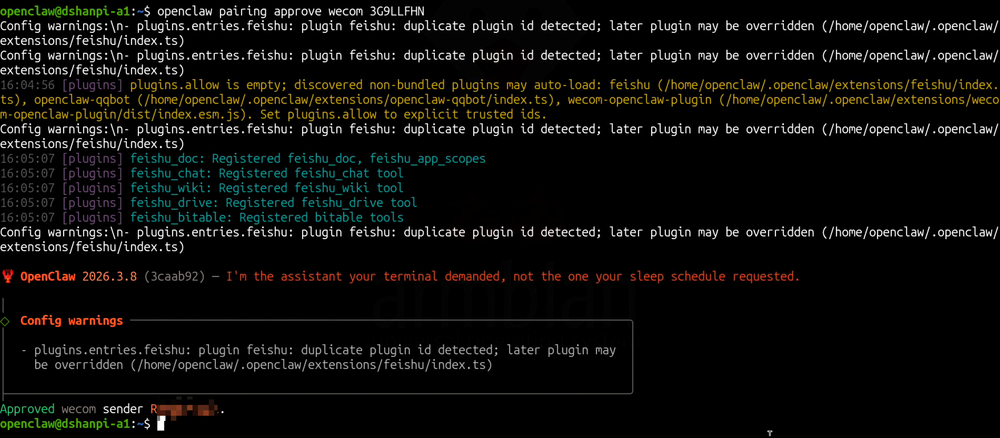

再次发送信息，如果配置成功，会收到OpenClaw的回复。

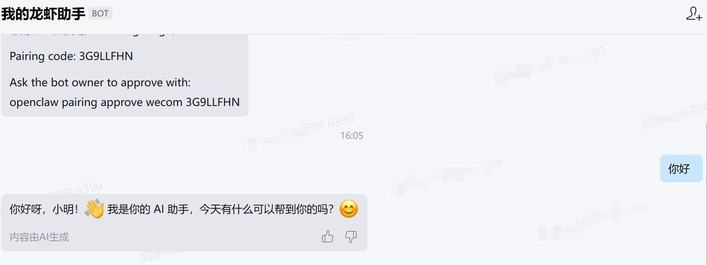

