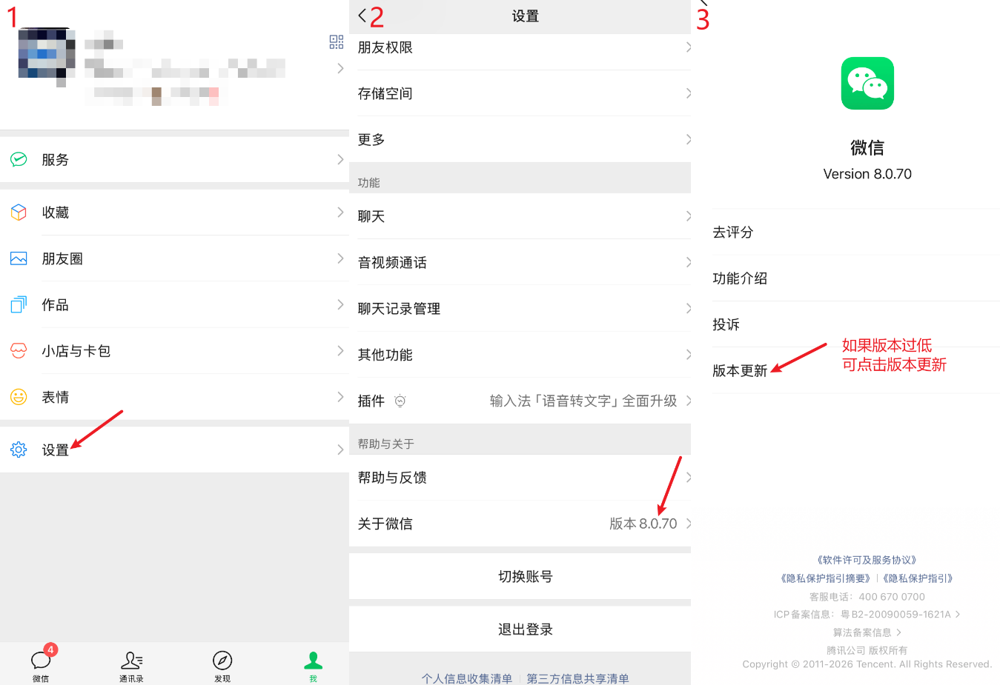
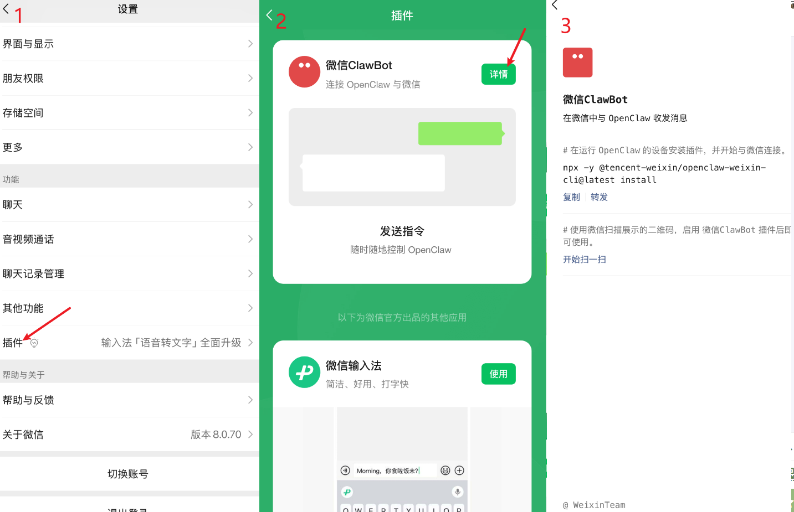
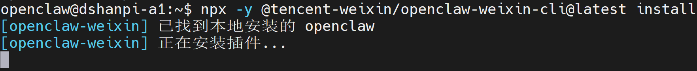
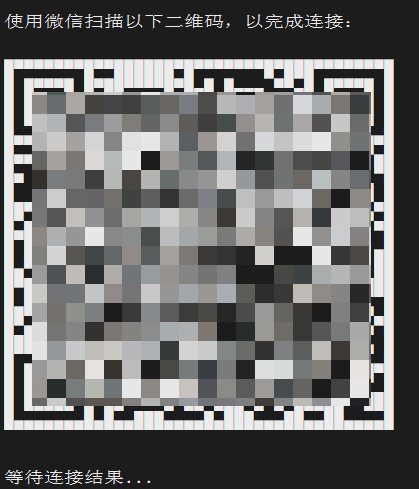
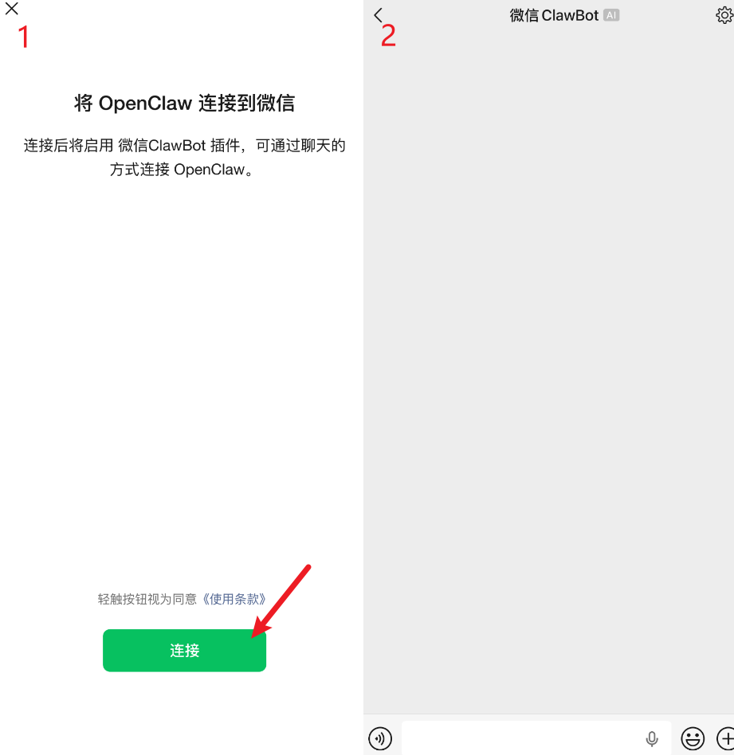
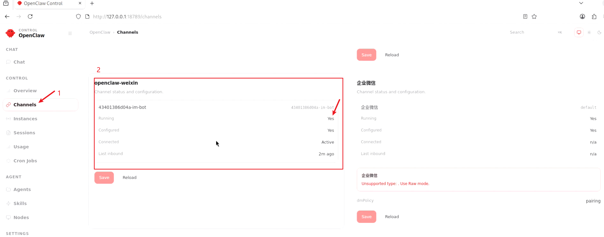
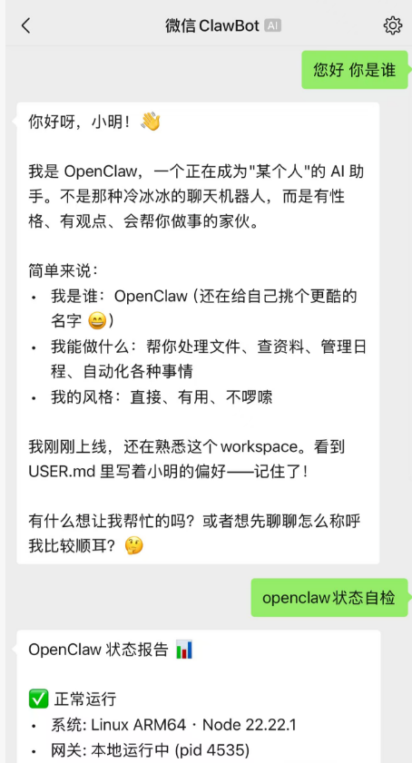

# 接入微信平台

## 前置条件

- 微信APP版本：8.0.70及以上




## 1.查看微信机器人插件

1. 在微信APP设置界面，点击**插件**，参考图1。
2. 找到微信ClawBot,点击**详情**，参考图2。
3. 在微信ClawBot界面可以看到安装命令，复制该行命令。参考图3。

```
npx -y @tencent-weixin/openclaw-weixin-cli@latest install
```

如果后续命令有更新，可按照图3的最新命令。




## 2.在OpenClaw中安装

1.打开OpenClaw主机设备的命令行终端，将复制的命令粘贴至命令行执行，：

```
npx -y @tencent-weixin/openclaw-weixin-cli@latest install
```



等待安装完成。。。


2.安装成功后，会自动生成二维码，使用微信扫一扫进行绑定：




3.微信扫描成功后，点击连接，等待连接成功后，可跳转到图2的微信ClawBot界面。



可以直接在输入框，发送内容进行聊天。

3.可在OpenClaw的Channels，查看openclaw-weixin微信会话状态。




## 3.测试

直接在微信ClawBot界面发送会话进行测试，如果配置成功了，OpenClaw会回复你。


