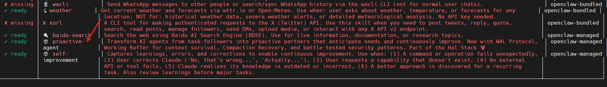
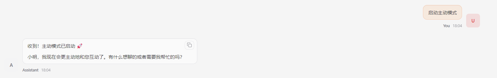
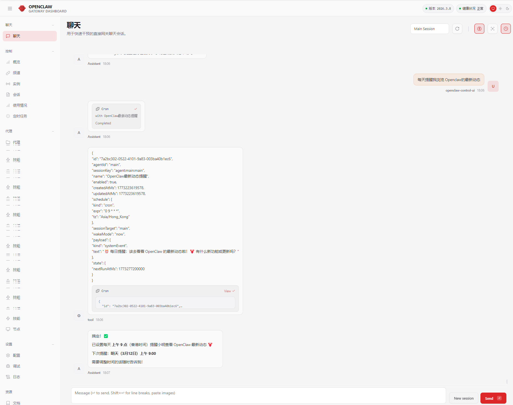

# OpenClaw增加主动创造

`proactive-agent` 这个Skill的核心定位是：**将AI从被动的任务执行者，转变为能主动预测需求、持续自我进化的合作伙伴**。

- **Proactive (主动性)**：能预测需求、进行反向提示（主动问你没想到的问题）、主动检查关注事项。
- **Persistent (持久性)**：通过 **WAL协议 (Write-Ahead Logging)** 在响应**前**写入关键细节，利用**工作缓冲协议**在上下文危险区（>60%）记录每一次交流，并能从压缩中恢复。
- **Self-improving (自我进化)**：具备自我修复能力、**不屈不挠的资源fulness**（尝试10种方法才放弃），并通过 **ADL/VFM协议** 设定安全护栏，防止进化失控。

简单来说，**`proactive-agent` 就像一个越来越懂你的私人助理，会主动观察、记住你的习惯和偏好，并提前为你考虑，而不是被动地等你吩咐。**


## 1.安装

1.在终端输入以下命令进行下载：

```
git clone https://github.com/halthelobster/proactive-agent.git ~/.openclaw/skills/proactive-agent
```


2.扫描skills

```
openclaw skills
```




3.重启 Gateway

```
openclaw gateway restart
```


## 2.测试

### 2.1 设置模式

在Web UI或者飞书界面发送`启动主动模式`。

```
你：启动主动模式
Agent：应该回复"已启用 proactive 模式，我会主动监控并提醒"
```




### 2.2 主动提醒

```
你：每天提醒我浏览 openclaw 的动态
Agent：设置定时任务，之后每天主动推送
```



### 2.3 主动提醒

```plain
你：每天提醒我浏览 ResearchWang 的推文
Agent：设置定时任务，之后每天主动推送
```

### 2.4 反向提示

```plain
你：帮我规划今天的任务
Agent：除了执行，还应该主动提出"要不要顺便整理昨天的会议记录？"
```

### 2.5 上下文恢复

```plain
你：我们刚才聊到哪了？（模拟重启后）
Agent：应该能回忆之前的对话状态，继续推进
```

### 2.6 主动监控

```plain
你：监控我的项目进度，有阻塞时告诉我
Agent：后台检查，发现问题时主动推送提醒
```

