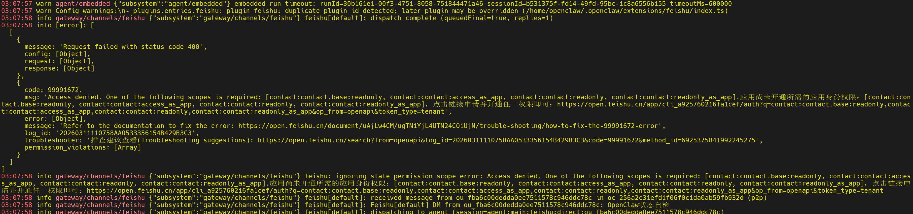
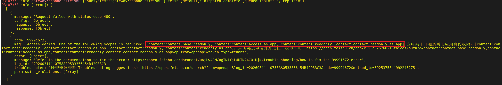
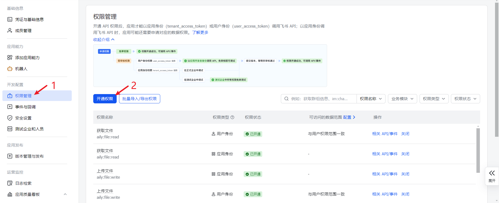
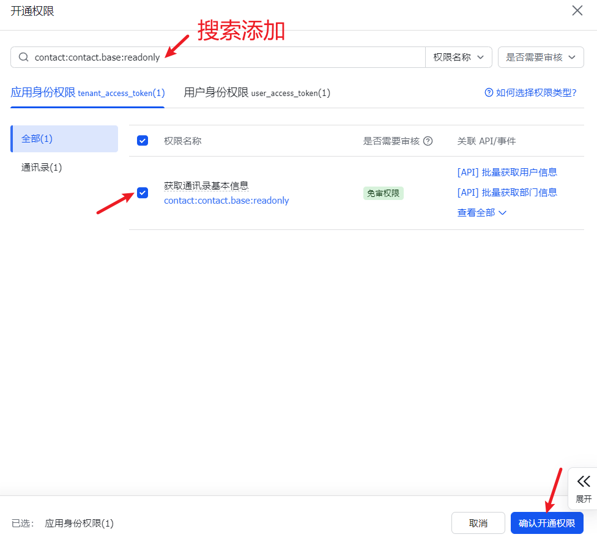
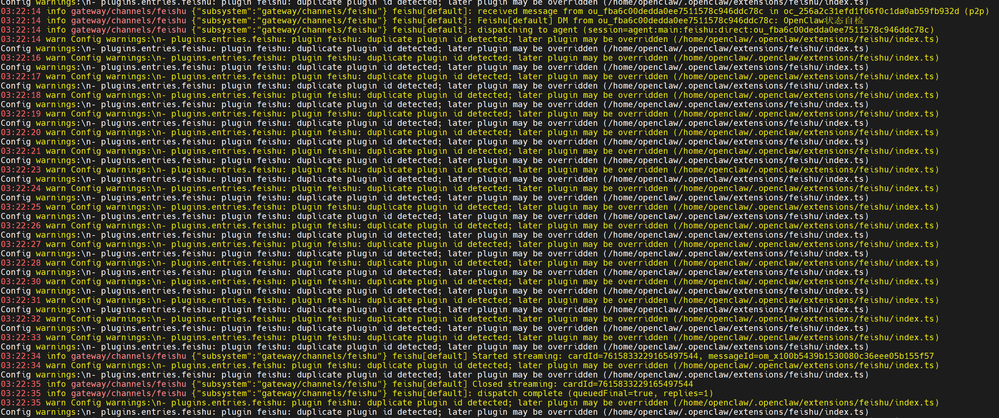

# 常见问题

## 1.Node service: systemd not installed Agent 没有 Node 服务导致不回复

原因：未安装Node Service。

解决办法：安装并启动 Node Service

```
# 安装 node service
openclaw node install

# 重启服务
openclaw gateway restart
```


## 2. API rate limit reached. Please try again later.

原因：大模型平台访问过于频繁，模型平台进行了限制，可尝试切换模型或者重新购买API Key。


## 3.应用尚未开通所需的应用身份权限

问题现象：




解决办法：找到LOG信息中打印的要求开通的权限：



打开飞书开发平台，找到**权限管理**,点击开通权限。



搜索LOG中要开通的权限，我这里我要求要开通：

```
[contact:contact.base:readonly, contact:contact:access_as_app, contact:contact:readonly, contact:contact:readonly_as_app]
```

这些权限，可以直接搜索对应的权限并添加。如果没有对应的权限，就忽略。



添加完成后，再次使用飞书询问，再查看log，不会再提示`应用尚未开通所需的应用身份权限`。

