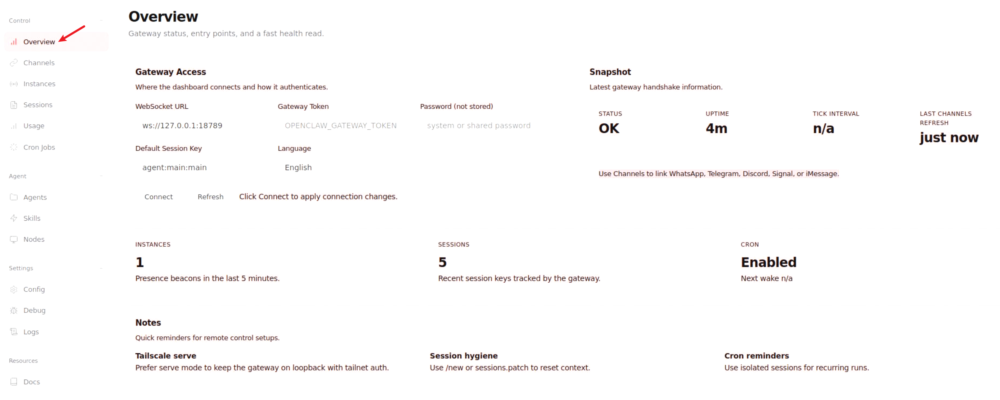
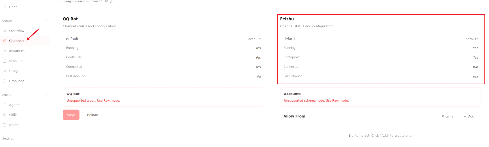
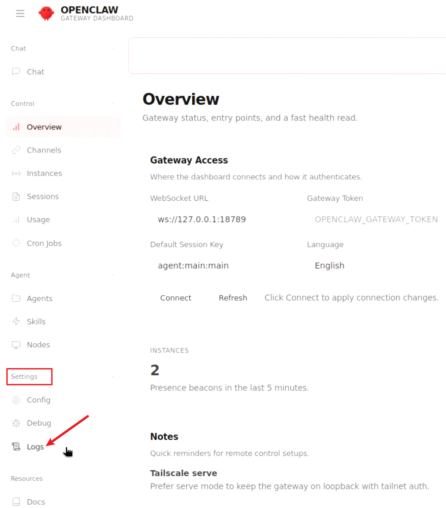
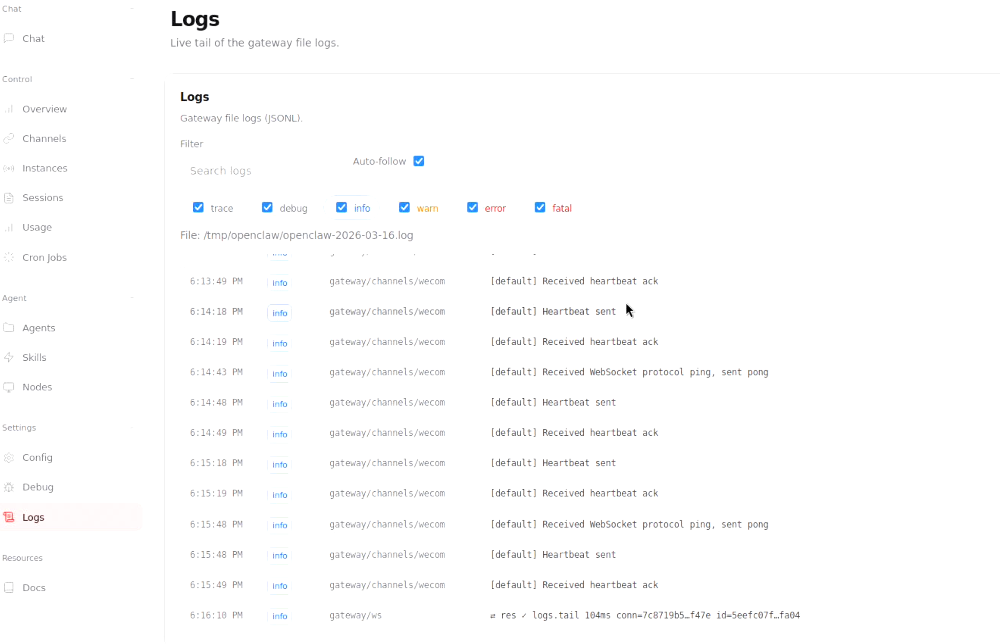
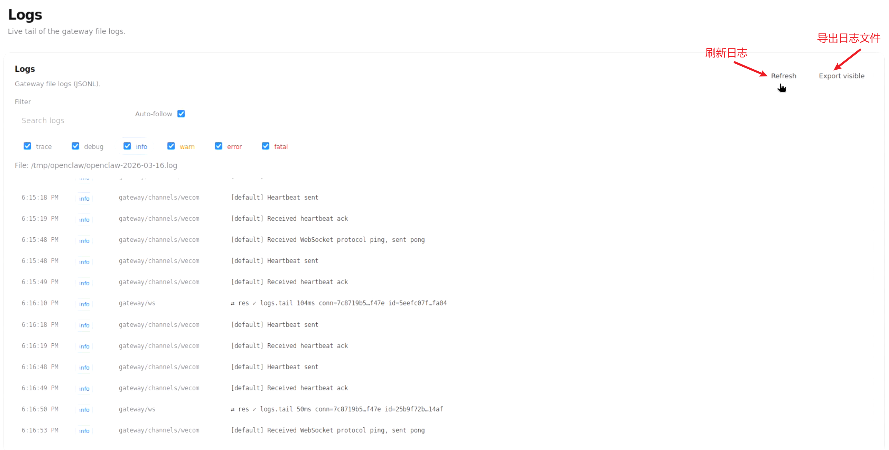
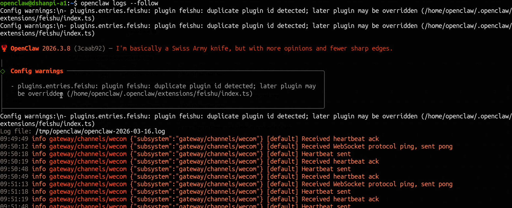

# 日志与监控
> 遇到问题不要慌，查看日志找原因
>

## 查看状态

打开OpenClaw Web UI界面，点击Settings下的**Overview**查看OpenClaw的**STATUS**是否为**OK**。



点击**Channels**通道，查看各个通道的状态，如果是飞书会出了问题，可查看飞书通道的状态是否正常。例如：Running状态是否为OK。



## 什么时候需要查看日志？

OpenClaw 运行过程中，如果遇到以下情况，可以通过日志定位问题：

| 现象 | 可能原因 |
|:---|:---|
| 开机后无法进入 OpenClaw 界面 | 系统启动异常 |
| 提示"连接失败"或"网络错误" | 云端服务对接失败 |
| 语音唤醒无响应 | 音频服务异常 |
| 界面卡顿或闪退 | 应用运行错误 |
| 功能突然不可用 | 配置异常或服务中断 |

---

## 查看日志的三种方式

### 1. 通过 OpenClaw 界面查看（推荐）

适合大多数用户，无需技术背景。

打开OpenClaw Web UI界面，点击Settings下的**Logs**



在这个界面下可以查看OpenClaw的日志信息。



可点击`Refresh`刷新获取最新日志，也可以点击`Export visible`打出日志。



**日志等级说明：**

| 等级 | 含义 | 处理方式 |
|:---|:---|:---|
| 🟢 INFO | 普通运行信息 | 正常，无需关注 |
| 🟡 WARN | 警告信息 | 可能影响体验，建议留意 |
| 🔴 ERROR | 错误信息 | 功能异常，需要排查 |
| ⚫ FATAL | 严重错误 | 系统无法正常运行 |


### 2.通过OpenClaw命令行查看（适合技术人员）

打开系统命令行，输入

```
openclaw logs --follow
```



运行后，会不断打印openclaw相关日志信息。