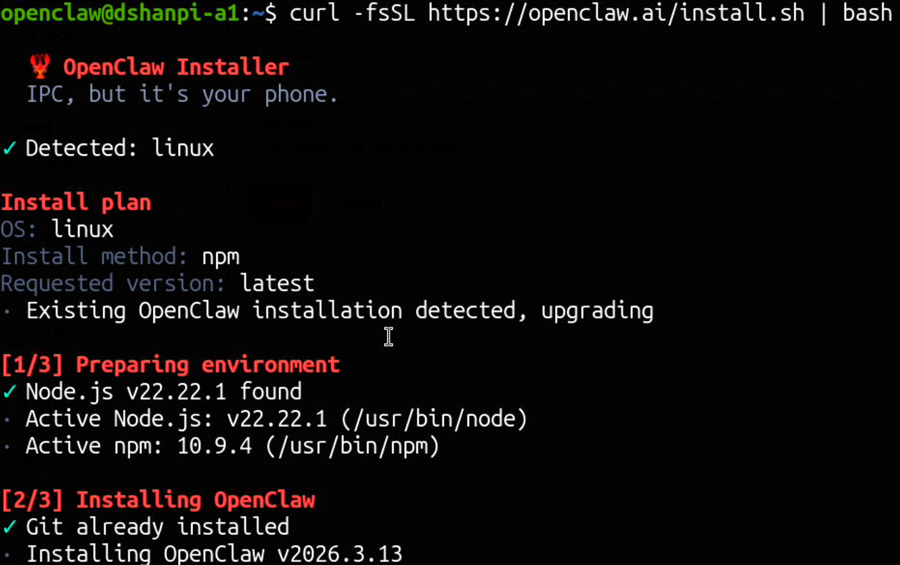
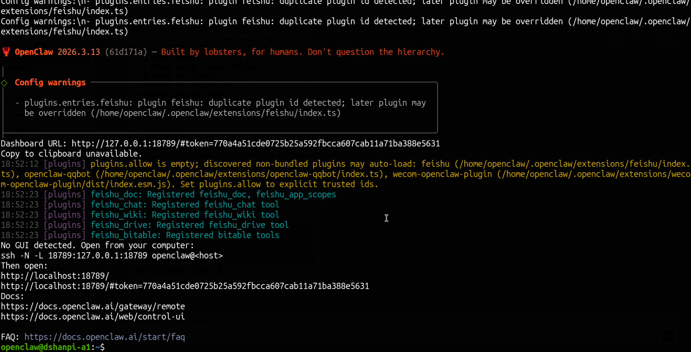

# OpenClaw更新

由于OpenClaw更新较快，这里提供OpenClaw的更新方式，这里我建议如果不追求新功能，可以选择暂时不升级，升级的bug是不可预见性的。


## 使用命令行的方式升级

目前最推荐的方式是，在命令行界面，执行以下命令：

```
curl -fsSL https://openclaw.ai/install.sh | bash
```

该命令会检测现有安装、原地升级OpenClaw。



等待系统升级成功即可。



升级成功后，可以看到OpenClaw会重新启动Web UI界面。可以重新访问浏览器查看OpenClaw的状态以及各个通道运行情况。
