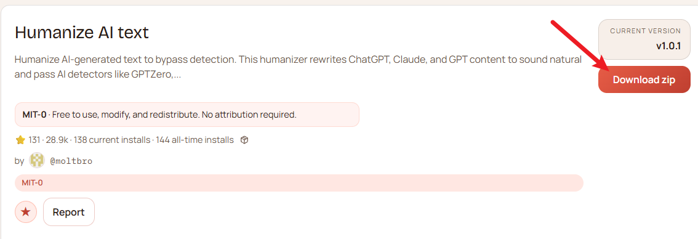
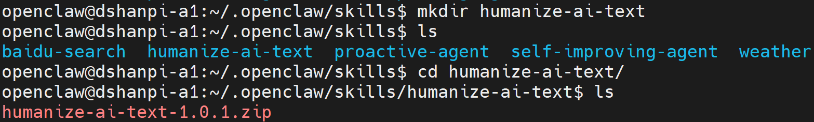
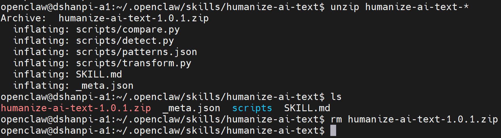
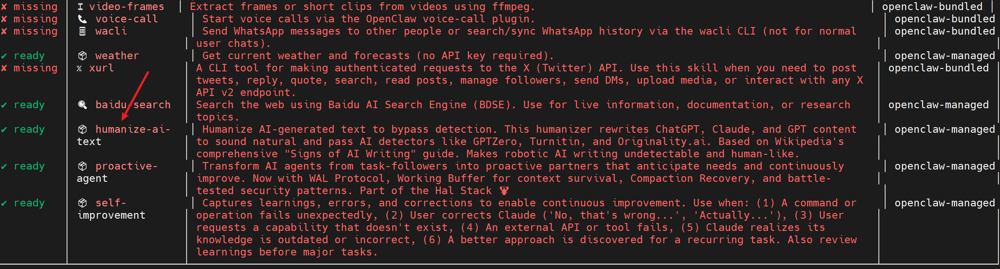

# 人性化人工智能文本

让AI生成的文本更具人性化，以绕过检测。这个人文化工具会重写ChatGPT、Claude和GPT内容，使其听起来自然


## 1.安装

1.前往[clawhub Humanize AI text](https://clawhub.ai/moltbro/humanize-ai-text)下载，或者点击下载H[umanize AI text](https://wry-manatee-359.convex.site/api/v1/download?slug=humanize-ai-text)。




2.新建`humanize-ai-text`文件夹，并将下载好的`humanize-ai-text-1.0.1.zip`（后续版本可能不一样），拷贝至`humanize-ai-text`目录下。

```
#新建文件夹
mkdir humanize-ai-text

#进入文件夹
cd humanize-ai-text

#拷贝压缩包至该目录下
```




3.解压压缩包

```
#解压压缩包
unzip humanize-ai-text-*

#解压完成后，删除压缩包
rm humanize-ai-text-1.0.1.zip
```




4.扫描Skills

```
openclaw skills
```



5.重启openclaw gateway

```
openclaw gateway restart
```


## 2.测试

直接想Web UI的对话页面或者飞书对话界面，直接提问： 

```
我已经在openclaw@dshanpi-a1:~/.openclaw/skills/humanize-ai-text$ ls
_meta.json  scripts  SKILL.md
安装了humanize-ai-text skill,帮我测试一下，这skill是否安装成功，顺便帮我测试一下
```

运行效果如下：


