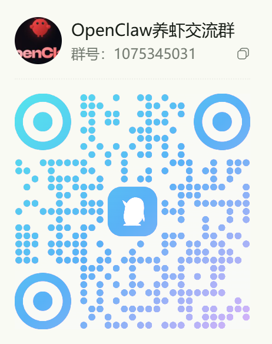

# OpenClaw主机介绍

## 产品概述

**OpenClaw 主机**是一款基于 **RK3576 高性能 AI 芯片**的桌面智能主机，专为个人 AI 助手场景打造。开机即用，无需复杂配置，让 AI 能力触手可及。

> **插电即用，AI 即刻为您服务**

## 产品展示

## 适合谁用？

| 用户类型 | 使用场景 |
|:---|:---|
| **效率工作者** | 桌面 AI 秘书，语音管理日程、速记会议、查询资料 |
| **内容创作者** | 灵感辅助、文案生成、资料整理，随问随答 |
| **AI 爱好者** | 零门槛体验本地大模型，探索人机交互未来 |
| **智能家居用户** | 桌面控制中心，语音联动全屋设备 |
| **开发者/极客** | 开放底层接口，二次开发无限可能 |

## 加入我们

### 交流群

扫码加入我们的交流群，与志同道合的伙伴一起探讨：

---

## 购买地址

官方淘宝店铺，正品保障，售后无忧：

[淘宝购买链接](https://item.taobao.com/item.htm?id=967894092488)

*OpenClaw —— 让 AI 回归桌面，让智能触手可及。*

